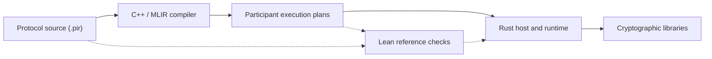

# zkc

zkc is a compiler for zero-knowledge **proof protocols**. It makes participant
computation, interaction, and protocol composition explicit, providing a common
foundation for analysis, optimization, and verification.

A circuit, AIR, or relation describes what is being proved. A protocol describes
how participants compute, exchange messages, obtain challenges, and check the
proof. zkc compiles that protocol into participant programs that execute using
cryptographic libraries.

The project is under active development. [Implementation status](docs/status.md)
records supported paths and their current boundaries.

## Why zkc?

- **Make the protocol visible.** Express participant computations, messages,
  challenge use, and subprotocol calls in one typed source. Keep reusable local
  algorithms separate from the interaction that uses them.
- **Share compiler infrastructure across protocols.** Use common analyses and
  transformation machinery while exposing domain operations and backend
  contracts. The compiler can work on computation, storage, and execution plans
  while retaining the conditions under which a change is valid.
- **Connect implementation and formal reasoning.** Give source programs and
  transformations explicit semantic contracts. Lean supplies definitions,
  reusable proofs, and executable references for checking supported compiler
  outputs.

zkc is intended for protocol authors, compiler developers, and researchers
working on proof-system implementation and verification. The
[project overview](docs/overview.md) develops the approach and its tradeoffs.

## A protocol in zkc

The [committed two-factor argument](examples/protocols/committed-two-factor.pir)
proves a product-sum claim about two committed polynomials. It composes Sumcheck
with openings of the original polynomials and a final verifier check.

This excerpt shows its interaction body. `P` is the prover and `V` the verifier;
the full source defines the inputs, local algorithms, and child protocols.

```text
dependencies (sumcheck: ProductSumcheck(n = n), opening: FactorOpening());
local [commit_factors] P: let (cf, cg, sf, sg) = CommitFactors(pk, f, g);
message [root_f] commitment: P(cf) -> V(root_f);
message [root_g] commitment: P(cg) -> V(root_g);
local [check_expected_roots] V: CheckExpectedRoots(root_f, root_g, expected_f, expected_g);
invoke [sumcheck_call] sumcheck(
  f,
  g,
  claim,
  coins
) -> (p_point, v_point, terminal_claim, next_coins);
invoke [open_f] opening(sf, p_point, vk, root_f, v_point) -> (f_value);
invoke [open_g] opening(sg, p_point, vk, root_g, v_point) -> (g_value);
local [terminal] V: let accepted = CheckTerminal(f_value, g_value, terminal_claim);
return (accepted, next_coins);
```

`local` places a computation at a participant; `message` transfers a value;
`invoke` calls a child protocol. The verifier first checks the commitments
against its public inputs, then checks the openings at the point derived by
Sumcheck. A separate [construction descriptor](examples/protocols/committed-two-factor.construction.pir)
selects the transcript-based execution used by the demo.

Other examples exercise different protocol structures:

| Example | What it expresses |
|---|---|
| [Groth16](examples/protocols/groth16.pir) | Proving and verification over a compiled R1CS, with snarkjs interoperability fixtures |
| [AIR and FRI](examples/protocols/air-oracle/README.md) | A bounded AIR permutation argument with quotient checks, Merkle openings, and FRI |
| [Reusable libraries and clients](examples/projects/README.md) | Separately authored protocol schedules importing checked implementation libraries |

See the [source language](docs/language/README.md) and
[protocol examples](examples/protocols/README.md) for complete sources.

## How it works



The frontend resolves libraries and checks types and requirements. The MLIR
compiler retains protocol and algebraic structure for analysis and transformation,
projects participant programs, and lowers them to physical execution plans.
Rust binds those plans to inputs and backend implementations and executes them.

For supported routes, independent Lean tools check candidate plans against the
retained source before execution. The [Lean library](formal/README.md) also
provides semantic definitions and proofs and can be used independently of the
native compiler. [Architecture](docs/architecture.md) explains the boundaries;
[assurance](docs/assurance.md) distinguishes formal proofs, executable checks,
and implementation trust.

## Try it

The supported development environment is x86_64 Linux with Nix. Follow the
[setup guide](docs/development/README.md#set-up-the-development-checkout) to
install Nix and enable flakes, then run from the repository root:

```sh
nix develop
just setup
just demo
```

`just setup` downloads development dependencies. `just demo` builds the tools,
generates development inputs, compiles the argument above, produces a proof, and
verifies it in a separate process. It reports `Proof accepted` and the output
directory containing `proof.bin` and the producer and validator reports.

The demo uses development keys and a nonhiding commitment scheme. The
[walkthrough](docs/getting-started.md) explains the individual steps and inputs.
For development checks, use the [test guide](tests/README.md#selecting-checks);
the full integration suite is separate from this first run.

## Explore

| You want to… | Start here |
|---|---|
| Write a protocol or library | [Source language](docs/language/README.md), [library projects](docs/language/projects.md) |
| Develop the compiler or a backend | [Architecture](docs/architecture.md), [extension guide](docs/development/extensions.md) |
| Study the semantics and verification | [Model guides](docs/guides/README.md), [specification](docs/spec/README.md), [Lean library](formal/README.md) |
| Assess current support and future work | [Implementation status](docs/status.md), [roadmap](docs/roadmap.md) |

The [documentation index](docs/README.md) maps the full reference.

## Contributing

Protocol examples, compiler improvements, formalization, and bug reports are
welcome. See the [contribution guide](.github/CONTRIBUTING.md) for development
and review expectations.

## License

Licensed under the [Apache License, Version 2.0](LICENSE.md).
