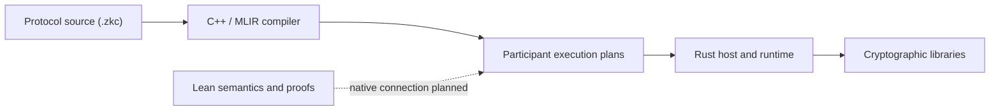

# zkc

zkc is a compiler for zero-knowledge **proof protocols**. It makes participant
computation, interaction, and protocol composition explicit, providing a common
foundation for analysis, optimization, and verification.

A circuit, AIR, or relation describes what is being proved. A protocol describes
how participants compute, exchange messages, obtain challenges, and check the
proof. zkc compiles that protocol into participant programs that execute using
cryptographic libraries.

The project is under active development. [Implementation status](docs/status.md)
records supported paths and their current boundaries.

## Why zkc?

- **Make the protocol visible.** Express participant computations, messages,
  challenge use, and subprotocol calls in one typed source. Keep reusable local
  algorithms separate from the interaction that uses them.
- **Share compiler infrastructure across protocols.** Use common analyses and
  transformation machinery while exposing domain operations and backend
  contracts. The compiler can work on computation, storage, and execution plans
  while retaining the conditions under which a change is valid.
- **Connect implementation and formal reasoning.** Give source programs and
  transformations explicit semantic contracts. Lean supplies definitions,
  reusable proofs, and executable references for checking supported compiler
  outputs.

zkc is intended for protocol authors, compiler developers, and researchers
working on proof-system implementation and verification. The
[project overview](docs/overview.md) develops the approach and its tradeoffs.

## A protocol in zkc

The [Schnorr library](examples/libraries/schnorr/lib.zkc) authors its exchange
with explicit roles and random services:

```text
let nonce = nonces.draw();
let commitment = send P -> V(base * nonce);
let challenge = challenges.draw();
let received = send V -> P(challenge);
let response = send P -> V(nonce + received * scalar);
let accepted@V = base * response == commitment + point * challenge;
return (accepted = accepted);
```

Its [Entry](examples/projects/schnorr/main.zkc) selects public inputs, the
acceptance result and a Fiat–Shamir construction. The compiler derives participant
transcripts and the common Host executes independent prove/verify calls.

| Example | What it expresses |
|---|---|
| [Public Sumcheck](examples/projects/sumcheck/README.md) | Bounded distributed repetition, vector kernels and an actual terminal evaluation |
| [Reusable libraries and clients](examples/projects/README.md) | Source libraries and separately authored Entry selections |
| [Committed product-sum](docs/compiler/committed-example.md) | Retained `.pir`/Lean workflow with Sumcheck and polynomial openings |
| [Groth16](examples/protocols/groth16.pir), [AIR and FRI](examples/protocols/air-oracle/README.md) | Retained protocol libraries and interoperability consumers during migration |

See the [source language](docs/language/README.md) for authoring and the
[migration inventory](docs/compiler/migration.md) for remaining consumers.

## How it works


```mermaid
flowchart LR
    source["Protocol source (.zkc)"] --> compiler["C++ / MLIR compiler"]
    compiler --> plans["Participant execution plans"]
    plans --> runtime["Rust host and runtime"]
    runtime --> backends["Cryptographic libraries"]
    formal["Lean semantics and proofs"] -. "native connection planned" .-> plans
```

The frontend resolves libraries and checks types and requirements. The MLIR
compiler retains protocol and algebraic structure for analysis and transformation,
projects participant programs, and lowers them to physical execution plans.
Rust binds those plans to inputs and backend implementations and executes them.

The `.zkc` path emits mathematical MLIR directly and independently checks source
correspondence. The common Host authenticates compiled packages and admits their
participant programs. Native Lean correspondence remains separate work. The
retained `.pir` route has independent source/candidate Lean checkers and remains
available for its [live consumers](docs/compiler/migration.md).
The [Lean library](formal/README.md) also supplies reusable semantics and proofs.
[Architecture](docs/architecture.md) explains these boundaries;
[assurance](docs/assurance.md) distinguishes formal proofs, executable checks,
and implementation trust.

## Try it

The supported development environment is x86_64 Linux with Nix. Follow the
[setup guide](docs/development/README.md#set-up-the-development-checkout) to
install Nix and enable flakes, then run from the repository root:

```sh
nix develop
just setup
just demo
```

`just setup` downloads development dependencies. `just demo` builds the tools,
uses known-witness demonstration inputs, compiles Schnorr, produces a proof, and
verifies it in a separate process. It reports `Proof accepted` and the output
directory containing `proof.bin` and the producer and validator reports.

The demo uses the public witness 3 and fresh runtime randomness. The
[walkthrough](docs/getting-started.md) explains the individual steps and inputs.
For development checks, use the [test guide](tests/README.md#selecting-checks);
the full integration suite is separate from this first run.

## Explore

| You want to… | Start here |
|---|---|
| Write a protocol or library | [Source language](docs/language/README.md), [library projects](examples/projects/README.md) |
| Develop the compiler or a backend | [Architecture](docs/architecture.md), [extension guide](docs/development/extensions.md) |
| Study the semantics and verification | [Model guides](docs/guides/README.md), [specification](docs/spec/README.md), [Lean library](formal/README.md) |
| Assess current support and future work | [Implementation status](docs/status.md), [roadmap](docs/roadmap.md) |

The [documentation index](docs/README.md) maps the full reference.

## Contributing

Protocol examples, compiler improvements, formalization, and bug reports are
welcome. See the [contribution guide](.github/CONTRIBUTING.md) for development
and review expectations.

## License

Licensed under the [Apache License, Version 2.0](LICENSE.md).
