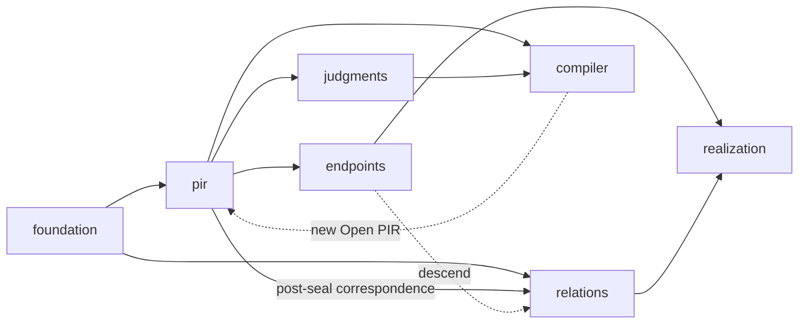

# zkc documentation architecture scaffold

> **Document kind:** Index
> **Document state:** Scaffold
> **Provisional owner:** `project`
> **Authority:** This tree has no semantic, status, or planning authority.
> The current [documentation map](../docs/README.md) and the owners it names
> remain authoritative until an explicit cutover.

`docs-next/` is a public-ready workspace for designing the next documentation
architecture. It starts with domain boundaries and governance rules before
moving any existing content. The structure is a research hypothesis: its names,
membership, and nesting may change when the specification and implementation
inventory provides better evidence.

The name is deliberately `docs-next`, not `docs-v2`. Reorganizing documents
does not create a new protocol version, artifact version, or product release.

## Where current truth lives

During this transition, use the existing owners for real answers:

| Question | Current authority |
|---|---|
| What is the intended semantic contract? | The individual [normative specifications](../docs/README.md#normative-specification) |
| What does the current checkout implement and exercise? | [Current Status](../docs/status.md) |
| What is the target architecture? | [Target Architecture](../docs/architecture.md) |
| What work is intended next, and in what order? | [Roadmap](../docs/roadmap.md) |
| What formal or experimental evidence is recorded? | [Formalization Evidence](../docs/formalization.md) and the linked evaluation records |
| How should a reader navigate the current corpus? | [Current documentation map](../docs/README.md) |

If this tree disagrees with any current owner, the current owner governs. A
disagreement is migration input, not permission to select the newer wording.

## Proposed shape

The top level is not one homogeneous list. It contains four kinds of area:

| Area | Directories | Role |
|---|---|---|
| Project governance | [`project/`](project/README.md) | Cross-domain scope, authority, architecture, status, roadmap, and documentation governance |
| Semantic domains | [`foundation/`](foundation/README.md), [`pir/`](pir/README.md), [`relations/`](relations/README.md), [`compiler/`](compiler/README.md), [`endpoints/`](endpoints/README.md), [`realization/`](realization/README.md) | The objects and transitions zkc defines |
| Property and assurance domains | [`judgments/`](judgments/README.md), [`evidence/`](evidence/README.md) | What can be concluded about semantic subjects, and what supports bounded claims |
| Reader journeys | [`guides/`](guides/README.md) | Tutorials and workflows that cite, but never replace, owning documents |

The following is a simplified primary lifecycle, not a complete import graph.
Exact dependencies and bridges are stated in the domain READMEs and the
[bridge map](project/information-architecture.md#4-bridge-ownership). Evidence
may bind a record to any domain and is omitted from the diagram for clarity.

`project/` and `guides/` describe or navigate this graph; they are not semantic
dependencies. Evidence may support claims about a semantic object, but evidence
never flows backward into that object's meaning or identity.

## Rules already adopted for the scaffold

1. Organize first by semantic ownership, then by document kind.
2. Do not mirror source-code directories or class names.
3. Give every definition one normative owner; other pages link to it.
4. Keep intended semantics, implementation status, evidence, architecture,
   decisions, plans, and tutorials visibly distinct.
5. Keep domain-local judgments with their subjects. `judgments/` is reserved
   for post-seal property analysis, not every operation called a judgment.
6. Keep shared mechanisms in `foundation/` only when no single semantic domain
   can own them without redefining another domain.
7. Treat `evidence/` as a system boundary for evidence objects and claim scope,
   not as a miscellaneous folder for supporting prose.
8. Assign every cross-domain bridge one owner and make it cite the producer's
   definitions rather than restating them.
9. Create no empty `spec/`, `architecture/`, `decisions/`, `plans/`,
   `evidence/`, or `guides/` subdirectories. Structure must follow durable
   content, not anticipate it.
10. Preserve one global status, one global roadmap, and one document manifest.
11. Keep internal research logs, review records, and task queues out of the
    public documentation tree.
12. Separate lossless structural migration from later semantic repair.

The detailed rules are in [Documentation Governance](project/documentation-governance.md),
[Information Architecture](project/information-architecture.md), and the
[Migration Policy](project/migration-policy.md). The
[Documentation Manifest](project/documentation-manifest.md) is the single page
inventory for this scaffold tree.

## Questions deliberately left open

- Should the long-lived domain be named `pir/`, or should a future
  `protocol/` domain contain PIR as its current carrier?
- Can `foundation/` remain narrow, or will mature artifact and representation
  semantics justify an `artifacts/` or `representation/` domain?
- Should `judgments/` eventually be renamed `analysis/` or
  `property-judgments/` to make its limited scope unmistakable?
- Is `realization/` the right umbrella for emission, deployment, invocation,
  and runtime, or will those subjects require a later internal split?
- Should evidence objects remain centralized under `evidence/`, or should the
  domain later be renamed `assurance/` so that local evidence records can use
  the word without ambiguity?

These are boundary-research questions. They are not roadmap commitments.
