# zkc documentation architecture scaffold

> **Document kind:** Index
> **Document state:** Scaffold
> **Provisional owner:** `project`
> **Authority:** This tree has no semantic, status, or planning authority.
> The current [documentation map](../docs/README.md) and the owners it names
> remain authoritative until an explicit cutover.

`docs-next/` is a public-ready workspace for designing the next documentation
architecture. It starts with domain boundaries and governance rules before
moving any existing content. The structure is a research hypothesis: its names,
membership, and nesting may change when the specification and implementation
inventory provides better evidence.

The name is deliberately `docs-next`, not `docs-v2`. Reorganizing documents
does not create a new protocol version, artifact version, or product release.

In this tree, a `completed` Stage 1--4A label records historical completion of
one bounded research package at its selection gate. It does not mean the
promoted candidate is mutually closed or semantically frozen. The
[v0 Semantic Design Program](project/v0-design-program.md#14-progress-and-change-control)
owns that live integrated-design gate. Bounded K3-D endpoint projection is
complete at its stated scope, but the kernel is not frozen and full Stage 4B
remains inactive.

## Where current truth lives

During this transition, use the existing owners for real answers:

| Question | Current authority |
|---|---|
| What is the intended semantic contract? | The individual [normative specifications](../docs/README.md#normative-specification) |
| What does the current checkout implement and exercise? | [Current Status](../docs/status.md) |
| What is the target architecture? | [Target Architecture](../docs/architecture.md) |
| What work is intended next, and in what order? | [Roadmap](../docs/roadmap.md) |
| What formal or experimental evidence is recorded? | [Formalization Evidence](../docs/formalization.md) and the linked evaluation records |
| How should a reader navigate the current corpus? | [Current documentation map](../docs/README.md) |

If this tree disagrees with any current owner, the current owner governs. A
disagreement is migration input, not permission to select the newer wording.

## Proposed shape

The top level is not one homogeneous list. It contains four durable kinds of
area and one temporary workspace:

| Area | Directories | Role |
|---|---|---|
| Project governance | [`project/`](project/README.md) | Cross-domain scope, authority, architecture, status, roadmap, and documentation governance |
| Semantic domains | [`foundation/`](foundation/README.md), [`pir/`](pir/README.md), [`relations/`](relations/README.md), [`compiler/`](compiler/README.md), [`oir/`](oir/README.md), [`realization/`](realization/README.md) | The objects and transitions zkc defines |
| Property and assurance domains | [`analysis/`](analysis/README.md), [`evidence/`](evidence/README.md) | What can be concluded about semantic subjects, and what supports bounded claims |
| Reader journeys | [`guides/`](guides/README.md) | Tutorials and workflows that cite, but never replace, owning documents |
| Temporary design incubation | [`notes/`](notes/README.md) | Non-authoritative redesign candidates, cautions, and questions awaiting absorption and deletion |

The following is a collapsed view of the selected Stage 1--4A subject,
transition, Protocol, Relations, Analysis, and Compiler architecture plus
explicitly labeled downstream boundary placeholders. It is not a complete
import graph or API; placeholder nodes do not select or activate their future
semantics.
Exact domain dependencies remain in the domain READMEs and the
[bridge map](project/information-architecture.md#4-bridge-ownership); the
[Transition and Bridge Architecture](project/transition-and-bridge-architecture.md)
records the selected cross-domain transition rules summarized here.

```mermaid
flowchart LR
  AU[Authoring unit] --> RU[Resolved authoring unit]
  RU --> C[Canonical Protocol candidate]
  C -->|authenticate identity and closure| AC[Authenticated canonical Protocol]
  AC -->|whole-Protocol admission| AP[Admitted Protocol]

  AP --> IF[Admitted Interface]
  AP --> PP[Admitted Plan]
  AP --> RB[Relations binding and correspondence]
  AP --> FS[Checked Fresh-to-FS construction]
  AP --> CP[Checked Core composition]

  AP --> AQ[Analysis question and exact basis]
  AQ --> AJ[Qualified Analysis judgment]

  AP --> TP[Transform problem and decision policy]
  TP --> PR[Open unauthoritative production and proposal occurrences]
  PR --> PS[Frozen declared proposal scope]
  PS -->|materialize proposal| C2[Successor candidate]
  C2 --> AC2[Authenticated successor]
  AC2 --> AP2[Admitted successor]
  AP -->|predecessor| CH[Checked change]
  AP2 -->|relation-specific checked edge| CH
  CH --> AR[Total alternative-resolution ledger]
  PS --> AR
  AR --> CD[Closed semantic candidate domain]
  CD --> QR[Total qualification resolution]
  QR --> Q[Closed comparison-alternative domain]
  AJ --> PF[Complete candidate-associated input portfolio]
  PF --> AS[Checked assessments where completed]
  Q --> AL[Total assessment-accounting ledger]
  AS --> AL
  AL --> SC[Checked decision sufficiency: complete assessment or certificate]
  SC --> DC[Branchwise bounded Compiler decision]
  TP -->|any exact reached qualified subset + audit accounting| OR[Checked explicitly open report]

  AP -->|affirmative purpose-specific source views| KO[Bounded K3-D OIR projection]
  KO -->|reserved later completion| O[Unactivated full Stage 4B: OIR]
  O --> X[Unactivated Stage 4B: realization and operation]
  X --> OBS[Deferred producer-owned observation / external receipt]
  OBS --> ER[Deferred Evidence record]
  ER --> CA[Deferred policy-qualified appraisal]
  CA --> RD[Deferred use-specific reliance]
```

The unactivated/deferred nodes show only the one-way ownership boundary needed
to keep Stage 4A independent. They define no OIR, realization, endpoint,
Evidence-policy, or reliance semantics and confer no corresponding authority.

`project/` and `guides/` describe or navigate this graph; they are not semantic
dependencies. A checked change, OIR, observation, appraisal, or reliance result
has only its named scope. Nothing downstream flows backward into Protocol
meaning, identity, authentication, or admission.

## Rules already adopted for the scaffold

1. Organize first by semantic ownership, then by document kind.
2. Do not mirror source-code directories or class names.
3. Give every definition one normative owner; other pages link to it.
4. Keep intended semantics, implementation status, evidence, architecture,
   decisions, plans, and tutorials visibly distinct.
5. Keep domain-local judgments with their subjects. `analysis/` owns only
   post-admission property analysis and its typed conditional judgments.
6. Keep shared mechanisms in `foundation/` only when no single semantic domain
   can own them without redefining another domain.
7. Treat `evidence/` as a system boundary for evidence objects and claim scope,
   not as a miscellaneous folder for supporting prose.
8. Assign every cross-domain bridge one owner and make it cite the producer's
   definitions rather than restating them.
9. Create no empty `spec/`, `architecture/`, `decisions/`, `plans/`,
   `evidence/`, or `guides/` subdirectories. Structure must follow durable
   content, not anticipate it.
10. Preserve one global status, one global roadmap, and one document manifest.
11. Keep private research logs, review records, and task queues out of the
    public documentation tree. Public-ready design incubation may exist only
    under `notes/`, under its explicit no-authority and deletion contract.
12. Separate lossless structural migration from later semantic repair.
13. Require open design-space and capability exploration in addition to
    testing the current model and candidate changes for failure.

The detailed rules are in [Documentation Governance](project/documentation-governance.md),
[Information Architecture](project/information-architecture.md), and the
[Migration Policy](project/migration-policy.md). The
[Documentation Manifest](project/documentation-manifest.md) is the single page
inventory for this scaffold tree.

The [v0 Semantic Design Program](project/v0-design-program.md) is the single
execution plan for semantic reconstruction and redesign inside this scaffold.
The [Design Research Method](project/design-research-method.md) defines the
common package cycle, candidate portfolio, opportunity discipline, scenarios,
evaluation axes, and convergence gates. These documents sequence research;
they do not replace the current product roadmap or grant authority to a target
design. The temporary workspace index routes to the historically completed
Stage 1, Stage 2, Stage 3, and Stage 4A research packages. Stage 1 selected the
subject and carrier architecture. Stage 2 selected domain-owned typed
transition contracts under shared project invariants. Stage 3 selected the
Protocol, canonical PIR, Interface, Plan, Relations, Fiat--Shamir, and
semantic-composition candidate at package resolution, promoted it into
candidate target owners, and produced separate Stage 4A and Stage 4B entry
contracts. Stage 4A selected the federated Analysis and validated-decision
Compiler architecture and promoted candidate target owners. K3-D subsequently
selected whole-source-provenance-free PIR endpoint views, a minimum target-semantic OIR body,
and an independent projection relation while leaving full Stage 4B
unactivated.

The first semantic reconstruction result is the
[Candidate v0 Semantic Architecture](project/v0-semantic-architecture.md). It
integrates the selected typed subject-and-transition backbone, evaluates which
current design choices should survive, and names the redesign questions that
remain before normative migration. It remains explicitly non-normative.

The first domain-level result was the
[Candidate Protocol Subject and Lifecycle](pir/protocol-lifecycle.md). It is
now the superseded baseline behind the completed Stage 1 package recorded in
the [temporary workspace inventory](notes/README.md#working-note-inventory).
The selected
[Protocol IR Architecture](project/protocol-ir-architecture.md) replaces its
single-level carrier choice with language-independent semantics, a rich MLIR
workbench, and one distinct small closed canonical PIR level. It also fixes
the Core, challenge interpretation, Interface, ProverPlan, regime, order,
checker, and compatibility boundaries consumed by the completed Stage 2
research.

The selected [Transition and Bridge Architecture](project/transition-and-bridge-architecture.md)
adds the cross-domain contract: authentication remains distinct from
admission; checked change separates target admission from the relation between
predecessor and successor; OIR projection consumes the exact Interface and a
tagged Plan basis; and evidence, appraisal, and reliance remain three
non-interchangeable downstream results. It is a non-normative target and does
not claim implementation.

The selected
[Protocol and Relations Architecture](project/protocol-and-relations-architecture.md)
records the Stage 3 package-selection center: a finite language-independent
operational Core/Protocol algebra has one physically canonical bijective MLIR
PIR carrier, while Interface, Plan, relation subjects, transcript construction,
and composition remain independently identified and admitted. Candidate target
contracts promoted at package resolution live under [`pir/`](pir/README.md)
and [`relations/`](relations/README.md). They remain non-normative until
explicit consolidation and cutover.

The selected [Analysis and Compiler Architecture](project/analysis-and-compiler-architecture.md)
adds family-owned semantic questions and qualified judgments, then separates
Compiler problem, production, proposal resolution, qualification/assessment,
and decision authority. Candidate target contracts promoted at package
resolution live under
[`analysis/`](analysis/README.md) and [`compiler/`](compiler/README.md), with
relation satisfaction and Protocol-correspondence reconciliation owned by
[`relations/`](relations/README.md) and the
cross-owner admitted-subject/checked-result binding specializations owned by
[`pir/`](pir/README.md). They remain
non-normative until explicit consolidation and cutover.

The bounded endpoint result is split between PIR-owned
[Endpoint Projection Views](pir/endpoint-projection-views.md) and the
[OIR Endpoint and Projection Contract](oir/projection-contract.md). It supports
FS verifier and Plan-specialized prover pressure cases only; it is not a full
OIR language, realization design, or implementation claim.

The [temporary design workspace](notes/README.md) preserves the larger catalog
behind those decisions while the design program is incomplete. It is not part
of the final information architecture. Reviewed conclusions must move into
their durable owners, and `notes/` must be deleted before cutover.

## Questions deliberately left open

- Which concrete independent consumer or retention promise will eventually
  trigger a portable full-Protocol representation beyond canonical MLIR PIR?
- Can `foundation/` remain narrow, or will mature artifact and representation
  semantics justify an `artifacts/` or `representation/` domain?
- Is `realization/` the right umbrella for emission, deployment, invocation,
  and runtime, or will those subjects require a later internal split?
- Should evidence objects remain centralized under `evidence/`, or should the
  domain later be renamed `assurance/` so that local evidence records can use
  the word without ambiguity?

These are boundary-research questions. They are not roadmap commitments.
