# Fiat--Shamir Assurance Across Semantic Freeze

> **Kind:** Temporary research-package index and freeze decision record
> **State:** Research complete from original baseline
> `808ec2d575da126f1d5cb22ad050ca52696dd75e`; synchronized to the committed
> no-rotation freeze checkpoint `a1585b2`; research and validation complete,
> with the containing branch commit serving as the handoff checkpoint
> **Authority:** None. Durable semantics remain owned by PIR, Relations,
> Analysis, OIR, and Realization.
> **Deletion rule:** Absorb retained requirements into their durable owners or
> explicit Stage 4B entry contracts, then delete this package before cutover.

## Decision

The Fiat--Shamir review supports and retrospectively confirms the
**no-rotation semantic freeze at `a1585b2`**. It does not support a
production-security claim.

The current target already has the right semantic factorization:

```text
InteractiveCore + FS interpretation
  -> exact typed frames, DerivedPrefix, RequiredInfluence, namespaces, retries
  -> Relations closes external Statement correspondence
  -> Analysis qualifies encoding, sampler, process, source property, theorem
  -> OIR preserves the selected static contract
  -> Realization validates a concrete provider, parser, and execution
  -> deployment policy may rely on the resulting qualified judgments
```

No counterexample found in this program requires an `FSKernel`, a transcript
root, an MLIR token as semantic authority, or movement of cryptographic
property meaning out of Analysis. The new Plonky3 transcript-binding advisory
instead confirms why the existing PIR nonclaim is essential: an exact logical
schedule does not establish that a concrete codec and state transition bind
distinct logical transcripts.

The immediate design consequence is therefore additive:

- preserve the canonical PIR construction unchanged;
- retain exact closed-Statement checking in Relations;
- add a reusable Analysis-owned FS assurance profile family after freeze and
  retain its exact Stage 4B intake;
- require OIR and Realization to preserve and validate every selected FS
  coordinate; and
- keep classical ROM, ideal-permutation, concrete-hash, and QROM claims in
  distinct profiles.

The duplex-sponge sibling remains operationally representable but theorem-
inactive. Its current source-validation findings still block theorem import;
this is an explicit `Unsupported`/`CannotAnswer` boundary, not a reason to
weaken the canonical construction or silently repair the paper.

## Package contents

- [Research Contract](research-contract.md) fixes the baseline, questions,
  candidate architectures, methods, evidence levels, and exit criteria.
- [Source Ledger](source-ledger.json) pins the exact paper and draft snapshots
  and identifies the live incident/advisory sources.
- [Theory and Methodology](theory-and-methodology.md) explains FS, BCS,
  state-restoration and RBR security, ROM/QROM, duplex sponges, formal
  verification, refinement, translation validation, SSA, and token-like
  lowering.
- [Attack Taxonomy and Obligation Matrix](attack-taxonomy-and-obligation-matrix.md)
  maps concrete bug families to their prerequisite violation, current zkc
  defense, residual gap, and executable falsifier.
- [Current zkc Semantic Audit](current-zkc-semantic-audit.md) reconstructs the
  live owner graph, reassesses historical cross-lane findings, and records the
  exact gap register.
- [Assurance Architecture and Stage 4B Contract](assurance-architecture-and-stage4b-contract.md)
  proposes the smallest owner-local extension and the OIR/Realization handoff.
- [Freeze Recommendation and Research Program](freeze-recommendation-and-program.md)
  gives the go/no-go criteria, phased work program, worktree strategy, and
  claim gates.
- The bounded
  [`evaluation/fs-assurance-pre-freeze/`](../../../../../evaluation/fs-assurance-pre-freeze/README.md)
  package supplies 33 finite positive and negative controls across ten
  assurance layers and sixteen attack families.

## Central finding

The security argument is a conjunction, not a single proof obligation:

```mermaid
flowchart LR
  S[Logical schedule] --> C[Closed Statement coverage]
  C --> E[Canonical injective encoding]
  E --> T[Concrete transition binding]
  T --> D[Challenge distribution]
  D --> P[Oracle-process correspondence]
  P --> H[Source property + theorem]
  H --> O[OIR preservation]
  O --> R[Realization conformance]
  R --> X[Deployment composition]
```



A formal proof of the verifier can discharge parts of `O -> R`. A BCS or
Fiat--Shamir theorem can discharge a selected `P -> H` edge under its exact
premises. Neither can substitute for the complete chain.

## Evidence boundary

This package establishes a source-grounded architecture decision and bounded
counterexamples. It establishes no collision resistance, random-oracle or
ideal-permutation correspondence, source theorem truth, state-restoration or
RBR property, soundness, knowledge soundness, zero knowledge, QROM security,
OIR execution correctness, compiler correctness, concrete-library
conformance, parser safety, or deployment readiness.
