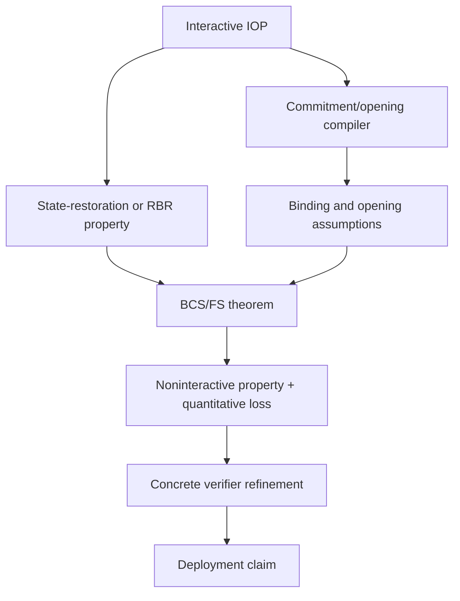

# Fiat--Shamir Theory and Assurance Methodology

## 1. The high-level transformation

An interactive public-coin protocol alternates prover messages and verifier
challenges:

```text
P -> a1
V -> c1 sampled after a1
P -> a2
V -> c2 sampled after (a1,c1,a2)
...
```

Fiat--Shamir removes the online verifier by replacing each challenge with a
deterministic query to an idealized random function, or with a separately
analyzed duplex construction:

```text
c_i = Decode(RO(Session, Instance, a1, c1, ..., a_i, Namespace_i))
```

The point is not merely that `c_i` is a hash. The security proof needs the
challenge to behave like the correct verifier coin **after** every object it is
supposed to bind and under the theorem's exact adversary model. That sentence
contains several independent obligations.

## 2. The nine-obligation model

### 2.1 Structural schedule

The logical protocol must determine every prior item, its order, active scope,
guard outcome, and challenge coordinate. A verifier that hashes the wrong
logical schedule can be perfectly implemented and still insecure.

In current zkc, `InteractiveCore` owns the verifier-observable interaction;
the canonical FS interpretation derives typed frames, exact prefixes, and
transition receipts from that Core. There is no authored per-message “hash
this” escape hatch.

### 2.2 Closed Statement correspondence

Strong FS requires the complete statement/instance relevant to the theorem and
application. “Hash every declared Statement” is not enough if an external
application can omit an expected Statement from the declaration itself.
Relations must therefore compare a closed external statement manifest with the
complete selected K2 binding domain.

This is where weak FS and Frozen Heart belong. It is not a sponge property.

### 2.3 Canonical encoding

Distinct logical tuples must not become the same pre-primitive input because
field boundaries, types, lengths, signs, endianness, or canonical ranges were
lost. The CFRG draft calls for prefix-free encoding and separately distinguishes
codec operations from proof serialization.

The relevant property is stronger than “the prover and verifier serialize the
same honest value.” It must cover adversarial values and reject noncanonical
representations.

### 2.4 Concrete state-transition binding

Even an injective logical frame encoding can feed a nonbinding adapter or state
transition. The 2026 Plonky3 advisory is the decisive pressure case:

- a missing length marker let absent limbs alias explicit zero limbs;
- incompatible radix conversions collapsed information;
- modular conversion dropped challenge entropy; and
- floor-sized limb decomposition discarded high bits.

The canonical PIR statement that a frame was “presented to the admitted state
transition” is therefore intentionally not a collision-resistance or binding
claim. Analysis and later Realization must qualify the concrete transition.

### 2.5 Challenge distribution

The interactive theorem usually expects a precise challenge distribution. A
modular reduction can be biased. Rejection sampling can be conditionally
uniform yet have an exhaustion branch. Multi-draw retry changes namespaces,
query counts, and loss accounting. These are theorem inputs, not coding
details.

### 2.6 Oracle-process correspondence

One observed challenge value with the right marginal distribution is not a
random oracle. A theorem may require:

- repeat consistency at the same index;
- independent uniform outputs at distinct, adaptively selected indices;
- an exact query domain and query count;
- off-image behavior;
- extractor-authorized reprogramming or rewinding; and
- in the duplex case, access to a random permutation and possibly its inverse.

The current AFK profile correctly asks for a complete adaptive lazy-random-
function process correspondence rather than finite output equality.

### 2.7 Source property and theorem

The interactive source needs the exact property consumed by the transform:
special soundness, state-restoration soundness, RBR soundness, an extraction
property, HVZK, or another theorem-specific notion. These notions are related
but not interchangeable.

The theorem then fixes quantifier order, adversary class, query budget,
extractor rights, loss formula, setup timing, challenge distribution, and
target property. A citation or family label is not an applicability result.

### 2.8 Projection preservation

OIR must preserve every semantic FS coordinate selected upstream: frame law,
prefix law, construction and Core identity, namespace recipe, algorithms,
sampler, retry/state transition, and failure type. Reordering or optimizing
requires a named refinement, not a weakened equality check.

### 2.9 Realization and deployment

A concrete implementation must reproduce the OIR behavior under exact
providers and parse/serialize the proof safely. Translation validation can
check each generated artifact; a verified compiler can prove a general
refinement; test vectors can catch selected mismatches. Deployment must still
bind the exact ciphersuite, application context, resources, and threat model.

## 3. What BCS does—and does not do

BCS is not “formally verifying the verifier.” It is a compiler and security
analysis for public-coin IOPs:

1. the prover's long oracle messages are committed, typically by Merkle roots;
2. verifier coins determine query positions;
3. the noninteractive proof carries queried values and authentication paths;
4. random-oracle calls replace the interactive verifier coins; and
5. the resulting soundness/knowledge guarantees are related to the source
   IOP's state-restoration properties plus commitment/oracle terms.

BCS therefore adds obligations rather than erasing them:



A formally verified implementation of the BCS verifier can establish that the
code follows its specified commitment, query, opening, and FS checks. It does
not prove the source IOP has state-restoration soundness, that the theorem
applies to the selected transcript and sampler, that the concrete hash realizes
the required oracle model, or that the specification included the whole
Statement.

## 4. Soundness notions worth keeping separate

| Notion | Informal question | Why it matters to FS |
|---|---|---|
| Standard soundness | Can a prover make one verifier accept a false statement? | Too weak by itself for many multi-round transforms |
| Special soundness | Can a witness be extracted from a structured tree/set of accepting transcripts with different challenges? | Supports selected multi-round FS theorems |
| State-restoration soundness | Can a prover win while restoring and exploring previously seen verifier states? | Characterizes the original BCS compiler's soundness |
| RBR soundness | Once a partial transcript is “doomed,” does it remain doomed except for bounded error? | Supports modern FRI/IOP FS analyses |
| RBR knowledge soundness | Can escaping a doomed state be turned into extraction? | Stronger and directional; not equivalent to special soundness |
| Adaptive soundness/knowledge | Can the statement be selected as part of the adversarial process? | Requires strong Statement binding and exact quantifier order |

The correct architecture does not choose one universal notion. It gives
Analysis a typed profile for each theorem family and refuses substitution.

## 5. Duplex sponges

A duplex sponge keeps mutable state and interleaves absorption and squeezing.
It can avoid recomputing a hash over the entire prefix and closely matches many
implementations. But “a sponge is indifferentiable from a random oracle” is not
automatically enough for every desired property.

The Chiesa--Orru analysis makes codec and theorem prerequisites explicit:

- injective prover-message encoders with an inverse on their image;
- verifier-message decoders with controlled bias and suitable fiber behavior;
- a salt and exact salt-generation/scope law;
- random permutation and inverse-query models with separate query bounds;
- state-restoration soundness or knowledge soundness of the source; and
- property-specific simulation/extraction correspondence.

zkc is right to model this as a sibling construction. The canonical-framed
profile has headers, typed frames, namespaces, and bounded retry that are not
the paper's raw codec/state machine. Reusing the duplex theorem for the
canonical construction would be a false correspondence even if both use a
sponge internally.

## 6. Classical ROM and QROM

Classical ROM gives an adversary ordinary adaptive oracle queries. QROM permits
queries in quantum superposition. Measuring a query to discover where to
reprogram disturbs the adversary, so classical forking and reprogramming
arguments do not transfer automatically.

Measure-and-reprogram results show that multi-round QROM transport is possible
for selected protocols, but with theorem-specific ordered extraction and query
loss. Therefore zkc should use a distinct QROM profile with:

- a quantum adversary and query ABI;
- exact reprogramming/extraction rights;
- a QROM theorem source and validation result;
- theorem-specific round/query loss; and
- an explicit bridge from the selected PIR query process.

“Post-quantum primitive” and “QROM-proven FS transformation” are different
claims.

## 7. Formal verification, refinement, and translation validation

These methods answer different questions.

### Refinement proof

A refinement proof establishes a general semantic relation such as:

```text
every observable behavior of Target is allowed by Source
```

For an FS verifier, the observation relation must include accepted/rejected
proofs, challenge queries, parser behavior, failure, and relevant effects. A
refinement proof is powerful, but it is only as sound as the source
specification and the selected relation.

### Translation validation

Translation validation checks a particular compiled artifact after the fact:

```text
Compile(source) -> candidate
Validate(source, candidate) -> qualified preservation result
```

It can reduce trust in a complex compiler because a smaller validator checks
each output. It does not prove outputs outside the checked artifact or
properties outside the validator's model.

### Mechanized cryptographic proof

VCVio demonstrates a third axis: machine-check a forking lemma and an FS
security reduction in a computational oracle model. This can discharge theorem
truth for its selected framework. It still needs correspondence from zkc's
protocol, query encoding, sampler, and implementation to that framework.

### Why all three may be useful

```text
mechanized theorem:       source property -> target cryptographic property
refinement proof:         OIR semantics -> implementation semantics
translation validation:  this emitted artifact preserves this OIR subject
```

They meet at typed assumptions and results; none should be renamed “verified
Fiat--Shamir” without its exact scope.

## 8. SSA and token-like sequencing

SSA gives each value one definition and makes data dependencies explicit. It
is useful for representing:

- the current transcript state;
- each absorbed frame;
- each squeeze output;
- the post-squeeze state;
- decoded challenges; and
- checks consuming those challenges.

A token-like SSA value can order side-effecting operations when ordinary data
dependencies are absent. MLIR has dialect-specific token-like types and effect
interfaces; there is no single universal MLIR “transcript token” whose mere
presence proves FS correctness.

The selected semantic model should therefore remain:

```text
InteractiveCore                 semantic interaction authority
FS interpretation              derives exact frames and prefixes
transition receipts/state      dynamic causal evidence
OIR SSA values                 explicit lowered dataflow
optional token-like values     target/dialect sequencing mechanism
```

SSA prevents accidental use-before-definition and makes later challenge
dependence inspectable. A linear token can prevent reordering or duplication
of effectful transcript operations. Neither proves:

- the complete Statement was declared;
- frame encoding is injective;
- the transition preserves every bit;
- challenge decoding is uniform;
- the source protocol meets the theorem premise; or
- the concrete provider matches its modeled primitive.

Thus the old token idea remains a useful lowering technique, not a semantic
owner. In the redesigned model the interactive Core is primary and the
transcript is a derived interpretation; Stage 4B may lower its receipt/state
chain to SSA and token-like dependencies while preserving the upstream laws.

## 9. A practical explanation for a workshop audience

The shortest persuasive explanation is:

> Fiat--Shamir replaces the verifier's future randomness with a deterministic
> function of everything the prover must already be committed to. Most real
> failures violate one of three words: **everything**, **already**, or
> **committed**. zkc derives “everything” and “already” from the interactive
> protocol's typed schedule. It then asks separate Analysis and implementation
> checks whether the concrete encoding and sponge really provide “committed.”

Then show three counterexamples:

1. omit the Statement: the attacker chooses it after the challenge;
2. derive the last challenge before the last proof elements: the attacker
   chooses those elements after the challenge; and
3. absorb all logical elements through a lossy limb adapter: two different
   transcripts still obtain the same challenge.

The key zkc claim is architectural, not triumphalist: it makes these three
failures land in three different typed obligations, so passing one cannot hide
failure of another.
