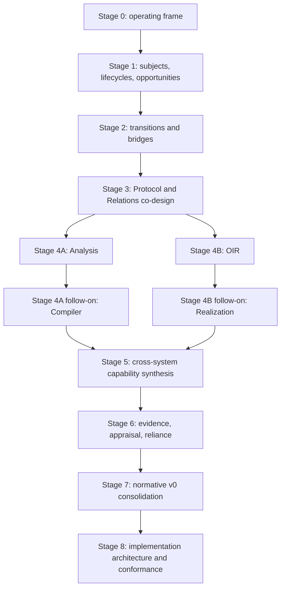

# v0 semantic design program

> **Document kind:** Design-research execution plan
> **Document state:** Active
> **Program status:** Active. The earlier bounded research packages are
> historically complete at their recorded selection gates. The freeze
> contract, executable foundations, Protocol/Fiat--Shamir kernel, minimum
> consumer seams, and one joined Schnorr path are complete at their declared
> scopes. Native FRI/IOR is retained as a two-lane conservative extension with
> deterministic source-schedule correspondence. Commitment-opening, complete-
> argument, and accumulation/folding/recursive-verification research are closed
> at their documented evidence levels. The fixed Nova fold has a complete
> source-grounded finite target encoding; the remaining named cases retain
> explicit finite-target elaboration gaps. Six stable upstream PIR profiles
> now have complete independently reconstructed publication artifacts.
> Holdouts, dependent-profile publication, and independent identity/profile
> freeze remain later. The
> kernel is not frozen, and full OIR/Realization remains unactivated.
> **Provisional owner:** `project`
> **Authority:** This is the single execution plan for semantic redesign inside
> `docs-next/`. It does not replace current product planning or roadmap
> authority under [`docs/`](../../docs/README.md), and it cannot make a target
> design normative or implemented.

## 1. Objective

The program will produce a coherent and complete v0 semantic architecture,
normative specification corpus, and implementation-conformance map. It may
preserve, reframe, extend, or replace current designs when research supports
that result.

The objective is not to make the existing documents tidier. Documentation
structure is an output of the semantic model. The primary work is to determine:

- which semantic subjects zkc owns;
- how their identities, authorities, environments, and lifecycles work;
- which transitions and correspondence obligations connect them;
- which current designs should survive;
- which alternative designs or new capabilities improve v0; and
- how the implementation corresponds to the selected model.

## 2. Program constraints

1. Work follows semantic dependencies, not top-level directories.
2. Current specifications remain authoritative until explicit cutover.
3. Code is deeply analyzed in every package but cannot silently decide
   intended semantics.
4. Each package performs both current-design reconstruction and open design-
   space exploration.
5. Passing existing scenarios does not end generative research.
6. Shared decisions converge across producers and consumers; local tracks do
   not independently ratify cross-domain contracts.
7. `foundation/` grows by extracting demonstrably identical mechanisms from
   domain work, not by designing a universal framework in advance.
8. Target specification drafts may develop package by package, but bulk
   migration and authority cutover wait for global coherence.
9. Implementation changes normally wait for normative readiness; isolated
   feasibility prototypes remain non-authoritative.
10. Evidence and reliance work stays downstream of the semantic subjects it
    describes and never flows backward into their meaning.

The common package method is defined by
[Design Research Method](design-research-method.md).

## 3. Dependency shape

The program has a sequential semantic spine, two research branches, and a
later convergence:



The arrows are decision dependencies, not a prohibition on early exploratory
research. A later track may survey alternatives before its inputs stabilize,
but it may not finalize a contract that depends on unresolved upstream
subjects.

## 4. Stage 0 — research operating frame

### Purpose

Establish one repeatable research and decision process before domain packages
begin. Prevent failure-only review, directory-by-directory local optimization,
untracked alternatives, and premature normative migration.

### Outputs

- this single execution plan;
- the common design-research method;
- four required lenses: reconstructive, generative, evaluative, integrative;
- candidate-portfolio and opportunity-discovery rules;
- representative scenario portfolio;
- common evaluation axes and convergence gates;
- research-state vocabulary;
- temporary-note absorption discipline; and
- a bounded charter for the first Stage 1 package.

### Exit condition

Another reviewer can begin Stage 1 knowing the central question, evidence
order, required outputs, design-space obligations, convergence rules, and
decisions that must remain open.

The operating frame is established. It did not itself authorize a Stage 1
conclusion; Stage 1 subsequently applied this method and promoted its reviewed
result into the owning PIR architecture page.

## 5. Stage 1 — semantic subjects, lifecycles, and opportunity space

### Central question

What are the complete semantic subjects and lifecycle capabilities that every
later domain must consume without inventing incompatible meanings?

### Work

1. Build a thin whole-system subject ledger.
2. Reconstruct the Protocol/PIR lifecycle in depth.
3. Distinguish Open content, sealed content, persistence, decoding, exact-
   environment admission, and consumer capabilities.
4. Record identity, mutability, authority, environment, binding time,
   supersession, and refusal for each role.
5. Use relation ingress, Analysis, Compiler, and OIR as boundary probes.
6. Derive zkc-native design forces and counterexamples before treating an
   external IR architecture as a template.
7. Study representative portable, multi-level, long-lived, and proof-system
   IRs, including both their strengths and decisions that installed-base
   pressure now makes difficult to revise.
8. Compare at least four independent architectures, including but not limited
   to PIR-centered, carrier-independent Protocol, Protocol-plus-
   representation, and consumer-view models.
9. Identify capabilities enabled or foreclosed by each alternative, including
   capabilities absent from the current design.
10. Pressure-test viable candidates against protocol-specific scenarios:
    interaction, Fiat--Shamir transformation, ordered effects, composition,
    endpoint asymmetry, semantic identity, persistence, independent checking,
    and evolution.
11. Define the latest responsible point for deciding the role of MLIR, the
    stable semantic boundary, dialect decomposition, and `pir/` versus
    `protocol/` ownership.

### Exit condition

A provisional semantic backbone is precise enough for transition research,
while unresolved schema and naming choices remain explicitly open. It must
avoid both accidental duplicate sources of truth and premature rejection of a
second representation whose independent purpose, laws, and synchronization
mechanism have actually been established.

This bounded package exit condition was judged satisfied at its then-current
resolution. Stage 1 was reopened and completed on 2026-08-22. Its research
record is routed through the
[temporary workspace inventory](../notes/README.md#working-note-inventory), and
its durable result is the
[Protocol IR Architecture](protocol-ir-architecture.md). The
[Candidate Protocol Subject and Lifecycle](../pir/protocol-lifecycle.md) is
retained as the previous baseline and evidence source, not as the selected
target.

### Reopening record — 2026-08-22

The affected conclusions are the selection of PIR as the sole v0 carrier, the
placement of the complete Protocol owner under `pir/`, the exact role of MLIR,
the single internal canonical-form boundary, and the rejection of other
portable or independently checkable semantic representations.

The package was reopened because:

- credible alternatives may unlock materially greater capability even if the
  previous candidate passes its known boundary tests;
- the earlier comparison did not include a sufficiently broad, source-backed
  study of mature IR families, proof-system IRs, or protocol semantics;
- pain points and difficult-to-reverse decisions in comparable systems were
  not yet treated as first-class evidence; and
- the ideal target must be designed before compatibility and migration cost
  are allowed to constrain it.

At Stage 1 package closure, Stage 2 remained paused by the program boundary even
though its source subject vocabulary was selected. Its earlier work was
retained as observations, scenarios, and counterexamples rather than ratified
contracts.
Stage 2 was subsequently activated and completed on 2026-08-22 by explicit
direction. That research authorization did not authorize implementation
change, migration, normative cutover, or Stage 3.

## 6. Stage 2 — transition and bridge contracts

### Central question

Which authority-bearing transitions connect the subjects, and what exact
preservation, refinement, correspondence, derivability, or non-preservation
relation does each claim?

### Work

- perform a bounded Stage 1 intake review: freeze the selected subject
  invariants, reconcile dependent terminology, and reopen a Stage 1 decision
  only through its explicit reversal conditions;
- classify author/import, seal, persist, decode, admit, link, analyze, checked
  transform, project, supplier binding, realization, deployment, invocation,
  appraisal, and reliance;
- define the inputs, issuers, validation bases, and composition laws of the
  named Stage 1 relation families without collapsing them into one universal
  transition relation;
- define source, target, environment, capability, binding time, success,
  refusal, identity effect, and residual trust;
- distinguish malformed, inadmissible, unsupported, negative judgment,
  endpoint rejection, and operational failure;
- establish boundary contracts for the dependent `ProtocolInterfaceId` and
  `ProverPlanId` subjects while leaving their complete field schemas to the
  producer-and-consumer co-design packages that own them;
- identify bridge owners without centralizing all bridges in one domain;
- compare per-transition checking, translation validation, portable witness,
  and direct trusted transformation models; and
- adopt a shared transition schema only if real transitions share semantics,
  not merely similar fields.

Stage 2 began from the fixed entry contract in the
[Protocol IR Architecture](protocol-ir-architecture.md): projection and
external correspondence consume a dependent `ProtocolInterfaceId`; a
`ProverPlanId` separately realizes Protocol-owned abstract obligations;
semantic subjects are regime-qualified; canonical PIR is a closed MLIR level;
and admission, transformation, projection, and property relations remain
distinct. Artifact admission must also distinguish the cited semantic closure
from a larger resolver or compiler environment.

### Exit condition

Every admitted current boundary and every selected target boundary can be
placed in one typed transition catalog without calling every arrow lowering or
every result valid. Later domain packages can refine their own subjects without
inventing hidden transition inputs or silently moving fields across the Stage
1 Protocol, Interface, and ProverPlan boundaries.

This exit condition was judged satisfied at the package's then-current
resolution. Stage 2 completed on 2026-08-22. Its
research record is routed through the
[temporary workspace inventory](../notes/README.md#working-note-inventory), and
its durable result is the
[Transition and Bridge Architecture](transition-and-bridge-architecture.md).
The selected target uses domain-owned typed contracts under shared project
invariants; it does not introduce a universal transition algebra, runtime
record, checker registry, or wire artifact. It also fixes the lifecycle split
between authentication and admission, checked-change layering, Interface and
tagged Plan projection inputs, qualified outcomes, checker-selection rule,
and the one-way observation--evidence--appraisal--reliance chain. Stage 3 was
subsequently activated at the bounded Stage 3.0 charter and intake gate.

## 7. Stage 3 — Protocol semantics, composition, and Relations co-design

### Current position

Stage 3 completed its bounded research package on 2026-08-22. Its temporary
package, routed through the
[temporary workspace inventory](../notes/README.md#working-note-inventory),
completed current reconstruction, open design-space and primary-source
research, five equal-resolution candidates, a frozen package-selection snapshot,
cross-cutting matrices, sixteen symbolic scenarios, independent parity and
source-transfer audits, convergence, durable promotion, and separate Stage 4A
and Stage 4B handoffs.

The selected [Protocol and Relations Architecture](protocol-and-relations-architecture.md)
uses one finite language-independent operational Core/Protocol algebra, one
physically canonical bijective MLIR PIR carrier, and independently identified
Interface, Plan, relation, transcript-construction, and composition subjects.
Candidate target contracts promoted at package resolution are owned by `pir/`
and `relations/`. This historical package result does not establish integrated
semantic closure and does not make the contracts normative, implemented,
migration-ready, or proven.

### Central question

How should the selected Protocol factorization become a complete semantic
contract and relate to external relation, instance, witness, committed-object,
and composition semantics?

### Protocol work

- exact `InteractiveCore`, challenge-interpretation, and Protocol grammar;
- transcript spine, total observable schedule, and claim-flow geometry;
- profiles, policies, routes, segments, checks, reductions, and terminals;
- canonical PIR grammar and complete Protocol/carrier correspondence;
- deterministic Fresh-public-coin and Fiat--Shamir Protocol construction,
  occurrence/transcript-prefix exports, and the exact seam and non-claims for
  later Analysis-owned theorem applicability and property-specific transport
  (called `FSCompile` in the historical Stage 2/3 packages);
- canonical identity, authentication, admission, and immutable capability
  contracts inherited from Stage 2;
- committed-object declarations and grounding boundaries; and
- structural composition and link.

### Relations work

- relation definition, interface, public instance, private witness, and
  relation instance ontology;
- pre-seal authoring ingress versus post-seal correspondence;
- public-instance and witness mappings;
- adapter authority and independently checkable transformations;
- relation grounding of opaque anchors and committed objects; and
- verifier-to-relation descent.

### Convergence rule

Neither side completes independently. Protocol design must be tested against
relation ingress and realization consumers; relation design must not acquire
authority over Protocol identity or claim satisfaction by convenience.
`ProtocolInterface` fields shared by relation and endpoint consumers are
converged jointly rather than finalized by either side alone.

### Exit condition

The Protocol and relation contracts can express current admitted cases and
credible future sources without using one object in incompatible authority
roles. Structural composition is defined; property and endpoint consequences
remain explicit inputs to later stages.

This exit condition was judged satisfied at the package's then-current
resolution. The selected model, alternatives,
reversals, exact non-claims, and downstream seams were promoted to durable
target owners. Both Stage 4 entry contracts were locally complete and mutually
consistent at that snapshot. Post-selection revalidation has reopened
integrated kernel closure without erasing the historical package result. No
Stage 4 branch was activated by Stage 3 closure.

## 8. Stage 4 — two coordinated branches

Stage 4 begins only after the shared Protocol subject and relation boundary are
provisionally stable. Stage 3 was judged to satisfy that prerequisite at its
package resolution, but post-selection revalidation has reopened the integrated
kernel. A branch still requires explicit activation under its own entry
contract. Exploratory work may begin earlier, but final decisions return to the
shared contracts.

`ProtocolInterface` and `ProverPlan` remain cross-package seams throughout
Stage 4. Each branch may refine the fields it consumes, but shared ownership,
identity, and noninterference rules converge before either branch exits.

### Stage 4A — Analysis, then Compiler

Analysis determines:

- question, property index, context, signature, binding, plan, derivation, and
  judgment roles;
- notion-specific calculi and genuinely shared envelopes;
- internal derivability authority versus external theorem correspondence;
- identity and portability of derivations and judgments;
- assumption, hypothesis, and correspondence boundaries; and
- exact theorem- or model-applicability checking and property-specific
  transport rules over the Stage 3 seam, without a generic `FSCompile`
  judgment that implies preservation; and
- extension rules for Analysis family data, judgment forms, bases, validation,
  operation policy, and property rules.

Compiler then determines:

- orchestration and exact consumption of predecessor/successor checks whose
  predicates and checking authority remain with their exact PIR, Relations,
  Analysis, or transform-family owner;
- separation of unauthoritative transform production, family-specific checked
  construction or transition authority, and Compiler decision authority;
- producer-profile and transformation-recipe extension without granting a
  recipe authority over Protocol admission or transition meaning;
- proposal, recomputation, legality, property constraint, objective, score,
  selection, and decision roles;
- persisted request, candidate, and decision scope;
- preservation and replay obligations; and
- terminology that cannot be confused with endpoint realization.

Compiler requirements may reopen the provisional Analysis envelope, but they
cannot make optimization policy part of property meaning.

**Selected Stage 4A package result:** at its then-current resolution, a
federated typed Analysis calculus separates
family semantic profiles from basis, support, validation, operation, and replay
identities. A five-plane validated-decision Compiler separates problem,
production, proposal resolution, qualification/assessment, and decision. Its
semantic `CandidateDomain` is distinct from the policy-derived
`ComparisonAlternativeDomain`. Candidate target owners are routed through the
[Analysis and Compiler Architecture](analysis-and-compiler-architecture.md).

### Stage 4B — OIR, then Realization

OIR determines:

- verifier and prover observable semantics;
- endpoint ABI, transcript, proof stream, witness capability, checks, decision,
  completion, refusal, and failure;
- standalone structural validity versus paired projection admission;
- projection coverage and source correspondence;
- effect-aware transformation and optimization boundaries; and
- OIR identity and provenance.

Realization then determines:

- supplier requirements and explicit binding;
- emitted artifact and target identity;
- correspondence or refinement between OIR and target behavior;
- deployment, invocation, session, and result lifecycles;
- operational refusal and resource assumptions; and
- the need, if any, for internal realization levels or independent validators.

Realization requirements may reopen OIR observables, but concrete suppliers
cannot acquire authority to change endpoint semantics.

### Cross-branch convergence checkpoint

Before the branches rejoin for Stage 5, both branches reconcile:

- protected observation and effect classes;
- Protocol, Interface, ProverPlan, successor, and OIR identity dependencies;
- property transport and projection-correctness assumptions;
- verifier-visible ordering and transcript behavior; and
- any field that one branch treats as semantic while the other treats as
  configuration or realization state.

### Exit condition

Each branch may close locally when its own contracts, peer-input boundary, and
noninterference rules are exact. Stage 4A selected a locally coherent candidate
at its then-current resolution against the frozen Stage 4B entry contract,
without activating or deciding Stage 4B. The combined Stage
4 exit requires both locally coherent branches to rejoin through exact Protocol
identities, relation roles, transition obligations, and the checkpoint above.

## 9. Stage 5 — cross-system capability synthesis

### Purpose

Perform a second generative pass after the local models exist. Discover
capabilities that become visible only when several redesigned domains are
combined.

### Questions

- Which sequential, product, shared-challenge, shared-state, recursive, or
  aggregate composition modes are now expressible?
- How do property judgments and hypotheses transport across each mode?
- Can verifier descent and imported-artifact verification be made bounded and
  explicit?
- Which named independent consumers justify purpose-specific Protocol, OIR,
  transition, or derivation views or certificates, and do any of them trigger
  the need for a complete carrier-neutral Protocol package?
- Do stable exchange, caching, or alternative carriers now have a justified
  semantic subject?
- Which new relation sources, calculi, transform families, endpoint kinds, or
  realization targets fit without kernel change?
- Which valuable options should be v0, explicit extensions, or deferred
  research triggers?

### Exit condition

System-wide capabilities and composition laws are either integrated, rejected
with durable rationale, or deferred with an exact trigger. No capability is
implied merely because local parts can be connected operationally.

## 10. Stage 6 — evidence, appraisal, and reliance

### Central question

How can attributed observations support bounded claims and consumer decisions
without becoming semantic authority?

### Work

- distinguish run result, receipt, evidence record, derivation, claim
  assessment, status claim, and reliance decision;
- define subjects, issuers, procedures, environments, scope, exclusions,
  supersession, and reproduction;
- place appraisal vocabulary under `evidence/` while keeping use-specific
  acceptance with the relying consumer;
- determine which records need durable identity and which remain derived views;
- keep evidence work proportional to the product semantic core; and
- avoid turning reference parity, a successful run, or a formal model into a
  broader claim.

### Exit condition

Evidence can describe every selected semantic and operational subject without
changing its meaning, and no evidence policy authorizes its own use.

## 11. Stage 7 — normative v0 consolidation

Target contracts develop during earlier packages. Stage 7 is the global
coherence and authority package, not the first time specifications are written.

### Work

- assign one normative owner to every definition;
- split mixed current specifications along semantic and authority boundaries;
- eliminate copied schemas, accepted sets, policy tables, identity tags, and
  authority lists;
- preserve complete old-to-new provenance;
- reconcile identity, version, admission, refusal, and extension rules across
  all domains;
- record accepted cross-domain decisions;
- validate clean-room implementability and representative end-to-end
  scenarios;
- classify intentionally deferred extensions; and
- absorb and delete the temporary design workspace before cutover.

### Exit condition

The shadow corpus is semantically coherent, mechanically complete, free of
temporary dependencies, and ready for one explicit authority cutover under the
[Migration Policy](migration-policy.md).

## 12. Stage 8 — implementation architecture and conformance

### Central question

How should the checkout correspond to the completed v0 design, and which
implementation architecture best preserves the selected boundaries?

### Work

For each normative surface, classify current implementation as:

```text
conforming
bounded
extension
divergent
absent
unverified
```

Then distinguish:

- implementation changes required for conformance;
- architecture refactors justified by real semantic seams;
- target contracts that new implementation evidence requires us to reopen;
- experiments or extensions that should remain outside v0; and
- validation needed for the exact changed surfaces.

Code structure is not forced to mirror documentation structure. A code split
requires independent responsibility, authority, lifecycle, consumer, or change
pressure; line count and directory symmetry are insufficient.

### Exit condition

The implementation plan is derived from explicit target contracts, every gap
has an owner and claim scope, and validation requirements are proportional to
the change.

## 13. Continuous cross-cutting tracks

These tracks run throughout the program:

### Foundation by extraction

Move a mechanism to `foundation/` only after at least two domains demonstrate
the same meaning and lifecycle. Domain-specific identity preimages,
vocabularies, and judgments remain local.

K1 selected a provisional Foundation candidate so that later consumers have
one concrete target to falsify. The extraction gate is not satisfied until K3
demonstrates at least two aligned consumers and confirms that no owner-specific
semantics leaked into Foundation.

### Global architecture

Maintain the typed subject-and-transition graph, ownership map, and deliberate
non-decisions. Update them only with conclusions a package establishes.

### Composition spiral

Study structural composition in Stage 3, property transport in Stage 4A,
endpoint and descent behavior in Stage 4B, and system-wide modes in Stage 5.
Do not expect one early composition pass to settle all four.

### Opportunity register

Record new capabilities, prerequisites, value, costs, and latest responsible
decision point. An opportunity may become v0, an extension boundary, a
roadmap item, or a rejected alternative.

### Implementation correspondence

Inspect code during every package, record current-to-target deltas after each
provisional decision, and postpone ordinary implementation changes until the
relevant normative-readiness gate.

### Interface and ProverPlan seams

Maintain one field-ownership ledger for `ProtocolInterface` and one
obligation/realization ledger for `ProverPlan`. A local package may add a field
only after stating why it is not Protocol meaning, another domain's subject,
or ambient implementation state.

### Semantic regimes and evolution

Track the semantic regime, identity encoding, schema, transport, admission
policy, and producer version as distinct axes. Cross-regime comparison or
upgrade requires an explicit relation; decoder success never implies semantic
preservation.

### Protected observers and effects

Track the exact owner-derived K2 binding, guarded occurrence, message, Oracle,
challenge, check, claim, reduction, failure, and terminal coordinates, plus
the FS framing and transition views, across transformation, projection,
realization, and composition. When measuring the current system, legacy
`TRANSCRIPT`, `WIRE`, `PUBLIC`, `CHECK`, `ARTIFACT`, `CLAIM`, and `TERMINAL`
categories are correspondence inputs rather than target authority. Local SSA
equality or operational success cannot silently stand in for source-qualified
preservation.

### Temporary-note absorption

Keep unresolved candidates and work-package material under `notes/`. Promote
complete conclusions into exact durable owners; do not make durable pages
depend on the incubation workspace.

## 14. Progress and change control

This section owns the live integrated-design closure state. Stage labels record
historical bounded-package outcomes; the integrated-closure row records whether
the promoted candidate is mutually closed and ready to freeze.

| Stage or gate | State | Durable result or next gate |
|---|---|---|
| Stage 0 | Established | Common method, program, and temporary-note discipline |
| Stage 1 | Historical package complete | Selected [Protocol IR Architecture](protocol-ir-architecture.md), supported by the Stage 1 package routed through the [temporary workspace inventory](../notes/README.md#working-note-inventory) |
| Stage 2 | Historical package complete | Selected [Transition and Bridge Architecture](transition-and-bridge-architecture.md), supported by the Stage 2 package routed through the [temporary workspace inventory](../notes/README.md#working-note-inventory) |
| Stage 3 | Historical package complete | Selected [Protocol and Relations Architecture](protocol-and-relations-architecture.md), candidate PIR/Relations target owners at package resolution, research evidence, and separate Stage 4A/4B entry contracts |
| Stage 4A | Historical package complete | Selected [Analysis and Compiler Architecture](analysis-and-compiler-architecture.md), candidate Analysis/Compiler target owners at package resolution, Relations/PIR reconciliation, research evidence, and an unactivated Stage 4B peer boundary |
| Integrated semantic-kernel closure | Semantic-target convergence reached; integrated closure is not yet met. Foundation, Protocol, consumer, joined-Schnorr, native FRI/IOR, commitment-opening, complete-argument, and accumulation/folding/recursive-verification pressure are complete at their documented evidence levels; six stable upstream PIR profiles are published; holdouts, dependent-profile publication, and independent freeze remain pending. | The accumulated target preserves the `InteractiveCore + ChallengeInterpretation` factorization, exact owner views, checked constructions, and separate Interface, Plan, Relations, Analysis, and OIR authority. The accumulation, folding, and recursive-verification study selects Plan-owned accepted-terminal continuation, site-qualified private exports, confidential grounding, a one-use same-process witness handoff with a finite public/private one-step recurrence join, and a distinct continuation-prover purpose. It rejects universal accumulator, folding-scheme, recursive-proof, and runtime child-Protocol roots and defers typed public Plan parameters. The fixed Nova fold has a complete source-grounded finite target encoding; the remaining named cases retain explicit finite-target elaboration gaps. Dependent profile publication, holdout validation, property judgments, full OIR/Realization, implementation correspondence/support, normative cutover, and independent identity/profile freeze remain open. |
| Stage 4B | Historical entry contract ready; activation blocked | OIR then Realization may activate only after integrated semantic-kernel freeze and a separate explicit decision. |
| Stages 5--8 | Not started as decision packages | Later stages may be surveyed for design forces but cannot finalize contracts that depend on unresolved earlier-stage results |

`Complete` in a Stage 0--4A row records historical package completion only. It
does not mean integrated definition closure, independent implementability,
semantic freeze, normative admission, implementation support, or cutover
readiness.

Stages advance by exit conditions, not by elapsed time, page count, or the
absence of discovered defects. A stage may revisit an earlier provisional
contract when:

- a new subject or consumer cannot be represented;
- a credible alternative unlocks materially greater capability;
- an identity or authority contradiction appears;
- clean-room implementation is ambiguous;
- implementation feasibility invalidates an assumed mechanism; or
- a later convergence review finds incompatible local assumptions.

Reopening records the affected conclusion, reason, dependent packages, and
new decision gate. It does not silently rewrite history or force downstream
work to pretend the old contract never existed.
