# Candidate v0 semantic architecture

> **Document kind:** Architecture proposal
> **Document state:** Active
> **Design maturity:** Reconstruction with selected semantic, transition,
> Protocol, canonical PIR, Relations, Analysis, and Compiler backbone; bounded
> consumer integration; one retained native FRI/IOR conservative extension;
> and commitment-opening, complete-argument, accumulation, folding, and
> recursive-verification pressure absorbed at documented evidence levels.
> Holdouts, complete owner-profile publication, independent identity/profile
> freeze, and normative cutover remain pending.
> **Provisional owner:** `project`
> **Authority:** Non-normative. This page is a reconstruction and design
> surface for `docs-next/`. The current specifications, status, architecture,
> and roadmap under [`docs/`](../../docs/README.md) retain their existing
> authority until an explicit review and cutover.

> **Stage 1--4A package convergence — 2026-08-22:** The selected semantic root,
> MLIR and carrier roles, identity boundary, representation levels, and
> consumer interfaces are recorded by the
> [Protocol IR Architecture](protocol-ir-architecture.md). The selected
> transition lifecycle, shared contract invariants, bridge ownership,
> checker-selection rule, outcome model, and Stage 3 boundary are recorded by the
> [Transition and Bridge Architecture](transition-and-bridge-architecture.md).
> The selected Protocol, canonical PIR, Interface, Plan, Relations,
> Fiat--Shamir, and semantic-composition model is recorded by the
> [Protocol and Relations Architecture](protocol-and-relations-architecture.md)
> and candidate target owners under `pir/` and `relations/`. The selected
> family-indexed Analysis and five-plane validated-decision Compiler are
> recorded by the
> [Analysis and Compiler Architecture](analysis-and-compiler-architecture.md)
> and candidate target owners under `analysis/`, `compiler/`, and the Relations
> satisfaction boundary. These packages selected and promoted a coherent
> candidate at their then-current resolution; they did not establish integrated
> semantic-kernel closure or freeze. The
> [v0 Semantic Design Program](v0-design-program.md#14-progress-and-change-control)
> owns that live gate. Stage 4B remains unactivated.

> **Algebraic-interaction research update — 2026-08-31:** Primary-source
> reconstruction of classical Sumcheck, modern layered GKR, duplex-sponge
> Fiat--Shamir, and the packed Boolean GKR variant preserves the flat
> Interactive Core and claim/reduction factorization. Direct finite Sumcheck
> and GKR encodings require no child runtime or universal transition algebra.
> The active Fiat--Shamir owner is now stated narrowly as one canonical-framed
> construction; literal duplex-sponge correspondence requires a conservative
> construction alternative for runtime initialization and proof-carried public
> material. The historical general Core-composition specification remains
> research input, not an active target contract. No protocol theorem, cost
> judgment, or implementation support follows from this update.

> **K1 integrated-closure update — 2026-08-26:** Bounded executable
> foundations are complete and provisionally absorbed into
> [Executable Semantic Foundations](../foundation/executable-foundations.md).
> This closes the bootstrap, typed identity, module, canonical-value,
> portable-function, typed-failure, and deterministic-evaluation substrate at
> K1 resolution. It does not ratify the historical consumer schemas or freeze
> the integrated kernel. At that checkpoint K2 Protocol/Fiat--Shamir closure
> and K3 consumer reconciliation remained; the K2 update below records the
> former's bounded completion.

> **K2 integrated-closure update — 2026-08-26:** Bounded Protocol and
> Fiat--Shamir closure is complete in
> [Interactive Core](../pir/interactive-core.md) and
> [Fiat--Shamir Construction](../pir/fiat-shamir.md). One literal finite Core
> now owns scoped public bindings, causal strategy execution, native finite
> Oracle interaction, claims/reductions, derived public-coin eligibility,
> and replay; the paired construction owns derived transcript influence,
> semantic namespaces, four one-result sampling algorithms, advancing retry,
> and exact typed exhaustion. This replaces the pre-K2 snapshots as the active
> target definition without making the target normative or implemented.

> **Transcript-family extension update — 2026-08-31:** Fiat--Shamir is now a
> family of closed sibling profiles over one unchanged `InteractiveCore`.
> [Canonical-framed](../pir/fiat-shamir.md) and
> [duplex-sponge](../pir/duplex-sponge-fiat-shamir.md) constructions retain
> distinct initialization, construction-public material, transition,
> challenge, receipt, failure, source-view, and Protocol identities. Adding a
> future unreferenced sibling does not rotate either existing family. The
> duplex operational state machine is specified, but its cited security
> theorems remain inactive because exact Analysis premises are absent and the
> reviewed source proof has unresolved call-count, decoder-fiber, and alphabet-
> encoding defects. This extension changes no Core occurrence or Fresh
> semantics and adds no endpoint or implementation support claim.

> **K3-B integrated-closure update — 2026-08-27:** The bounded dependent
> consumer lane is now reconciled in the active
> [canonical carrier](../pir/canonical-pir.md),
> [Interface and Plan](../pir/interfaces-and-plans.md),
> [relation model](../relations/relation-model.md), and
> [Protocol correspondence](../relations/protocol-correspondence.md) targets.
> K3-B selected split Protocol/Plan relation bindings, the narrow source-ID-free
> `PlanWitnessSurface`, distinct value-bridge/refinement/commitment contracts,
> public execution-issued grounding views, and an exact factor-preserving K2
> carrier. It did not close Analysis, OIR, protocol-family coverage, or the
> integrated kernel.

> **K3-C integrated-closure update — 2026-08-27:** The bounded minimum
> Analysis lane is now reconciled in the active `analysis/` targets. It keeps
> three seams distinct: a finite native relation-bound Schnorr judgment; an
> abstract-family AFK classical-ROM transport that requires an independently
> established uniform all-`n` source-property capability and theorem truth; and
> a pointwise family/member specialization from an already established family
> target judgment. K3-C defines no native authority that mints the family source
> capability, so the family transport returns `CannotAnswer` absent an external
> proof authority; the finite native judgment cannot fill that slot, and the
> pointwise seam cannot generalize it. The selected profiles retain the
> Definition 10 quantifier order, a `q = 1` theorem instance, the raw Schnorr
> public key with fixed public setup, the exact K2 logical-query carrier, signed
> lower bounds, and every premise. A finite instrument pressures formation and
> refusal only. K2 was not reopened, no cryptographic property was proved, and
> at that checkpoint K3-D/K3-E still owned OIR and integrated closure; the
> following update records K3-D's bounded result.

> **K3-D integrated-closure update — 2026-08-28:** The bounded minimum OIR
> lane is now selected in
> [Endpoint Projection Views](../pir/endpoint-projection-views.md) and the
> [OIR Endpoint and Projection Contract](../oir/projection-contract.md). PIR
> derives exact whole-source-provenance-free purpose views; OIR separately
> authenticates and admits target semantics and validates exact graph/static-
> contract correspondence. K3-D
> supports canonical-framed FS verifier and Plan-specialized prover endpoints over base
> non-Oracle, non-module K2 effects, with closed typed unsupported rows and no
> partial target. It did not reopen K1 or K2, activate full Stage 4B, select a
> concrete OIR carrier, or establish any cryptographic property. At that
> checkpoint K3-E still owned integrated closure; the following update records
> its bounded result.

> **K3-E integrated-closure update — 2026-08-28:** The bounded joined
> P01/Schnorr path now composes across exact shared K1/K2/K3-B implementations,
> K3-C Analysis, and K3-D endpoint projection. The repair locally rotated the
> K1 profile/regime and inert authority envelope, added exact K2/K3-B profiles
> and owner exports, and reclosed the affected K3-C and K3-D boundaries while
> preserving the verifier-observable Core, Fresh/Fiat--Shamir interpretation,
> and transcript-construction architecture. The endpoint authority join keeps
> K2 static views, an affirmative checked FS construction and its issued view,
> the K3-B Interface view, and Prover-only `CheckedPlanRealizes` distinct. A
> purpose-bound adapter closes only the selected finite path; its richer
> future-owner facts remain a carrier residual. The Analysis lane
> deterministically rederives its selected records and checks stable IDs; no
> live Analysis capability crosses into endpoint projection or is exercised by
> the joined finite path. The protocol portfolio and independent freeze remain
> pending, and Stage 4B remains inactive.

> **Native FRI/IOR closure update — 2026-08-30:** One combined two-lane case
> retains the earlier early-terminated control and a separate frozen exact
> three-fold/scalar-terminal control. PIR now distinguishes initial and prover
> Oracles, owns logical access and a checked profile-bound Oracle-commitment
> construction, and issues one causal purpose-bound confidential initial-
> Oracle view. Relations owns the matching material-agreement question without
> widening the public run view or retaining a secret-derived identity. The
> committed Core then has distinct Fresh and Fiat--Shamir Protocols over one
> unchanged `CoreId`. This is structural authority only: exact classical
> Analysis questions remain candidate or unsupported pending an explicit
> owner profile and complete premise authority.

> **Commitment-opening semantics update — 2026-08-31:** Source-grounded
> comparison of the binary-field IOPCS and four KZG opening/aggregation shapes
> selects one narrow verifier-side profile for explicit public setup, ordered
> `(commitment, query, asserted answer)` claims, evidence, and bounded checks.
> Oracle authentication consumes that profile but retains its source-to-target
> construction and replaces universal equality deduplication with profile-local
> evidence coverage. Private polynomials, producer algorithms, material
> correspondence, and all cryptographic properties remain with Plan,
> Relations, and Analysis. No generic queryable object or universal batch-
> opening construction is selected.

> **Complete-argument organization update — 2026-08-31:** Source-grounded
> reconstruction of PLONK/Plookup, Groth16, Bulletproofs, and two recent lookup
> variants retains one flat finite verifier Core rather than adding an
> `Argument` or runtime child-Core subject. Protocol-produced proof fields keep
> their causal message occurrences; Interface and OIR may project them into one
> package without changing transcript order. Pairing-only and inner-product
> checks remain ordinary Core checks unless they match an exact commitment-
> opening claim/evidence profile. A zero-challenge Core has its ordinary Fresh
> Protocol but cannot form the canonical-framed Fiat--Shamir construction,
> because no challenge would be transformed. Public prover-only setup material
> exposes a Plan lifecycle question that is intentionally co-designed with the
> next accumulation package before any dependent identity is rotated.

> **Accumulation, folding, and recursive-verification update —
> 2026-08-31:** The fixed committed relaxed-R1CS Nova fold reaches T2
> constructive-encoding depth.
> Corrected-cycle Nova, HyperNova, CycleFold, ProtoStar, LatticeFold+, and
> imported recursive verification retain explicit finite-target elaboration
> gaps. Across those results, the selected target adds Plan-owned accepted-terminal recipes, an
> exact strategy-adapter/session boundary, site-qualified private exports,
> confidential grounding, a one-use same-process output-to-fresh-ingress
> handoff, a finite public/private one-step recurrence join, and a distinct
> continuation-prover endpoint purpose. Typed public Plan parameters are
> deferred, and no universal accumulator, folding-scheme, recursive-proof, or
> runtime child-Protocol root is added. Complete owner-profile preimages,
> independently reconstructible profile identities, holdout validation,
> independent identity/profile freeze, property judgments, full
> OIR/Realization, implementation correspondence, and normative cutover remain
> open.

> **Live closure status:** The
> [v0 Semantic Design Program](v0-design-program.md#14-progress-and-change-control)
> is the sole durable owner of the current integrated gate. This architecture page
> records selected structure and open research surfaces rather than duplicating
> subphase status.

## 1. Result of the first reconstruction package

The current zkc design should not be replaced with a conventional source-to-
backend compiler stack. Its strongest decisions remain coherent across the
live specifications and implementation:

- the primary subject is an explicit compiled proof protocol;
- transcript order and logical claim flow are different semantic geometries;
- carrier authentication and whole-Protocol admission are distinct gates;
  neither establishes cryptographic security or relation satisfaction;
- property analysis is post-seal, notion-indexed, and conditional;
- compiler search and producer reports may be untrusted while a smaller core recomputes the
  authoritative decision;
- prover and verifier endpoints are projections from one admitted protocol;
  and
- concrete suppliers and runtime values never acquire protocol semantic
  authority: any choice that can change protocol meaning must be selected and
  fixed in upstream Protocol semantics rather than treated as downstream
  supply.

The original weakness was global rather than local: strong pieces existed, but
not one complete typed model of their semantic objects, authority-bearing
transitions, correspondence obligations, refusal boundaries, and independently
qualified admission states. Stages 1--4A selected and distributed a typed
candidate model through Analysis and bounded Protocol selection. Post-selection
revalidation has not yet established it as a closed, independently
implementable semantic kernel. Later OIR, Realization, cross-system capability,
Evidence, consolidation, and implementation packages remain. The selected
backbone for v0 is therefore a **typed subject-and-transition architecture**,
not a new universal IR, a universal transition runtime type, or a
documentation tree treated as an architecture.

This page remains the whole-system design frame for that graph. Exact Stage
1--4A schemas now route to their durable domain owners; later-stage schemas remain
open. This page does not migrate any current specification or claim that target
roles are implemented.

The previous Stage 1 package produced a coherent baseline candidate,
the [Candidate Protocol Subject and Lifecycle](../pir/protocol-lifecycle.md),
which selected one complete abstract Protocol root, one internal identity
projection, PIR as the sole supported v0 carrier, a typed seal-authority graph
distinct from opaque referenced subjects, and process-local admission
capabilities. Comparative research retained its strongest lifecycle
distinctions but replaced its single-level carrier choice. The selected target
has language-independent semantics, a rich MLIR workbench, one distinct small
closed canonical PIR level in MLIR, regime-qualified compositional identities,
and dependent Interface and ProverPlan subjects.

## 2. Interpretation discipline

The page uses five labels:

| Label | Meaning here |
|---|---|
| **Current invariant** | Reconstructed from the current normative specifications |
| **Implementation correspondence** | The current checkout visibly realizes the invariant, without making code the semantic authority |
| **Selected target** | A reviewed non-normative architecture decision selected by a completed research stage |
| **Candidate** | Recommended architecture for v0, not yet a normative decision |
| **Open** | A design question requiring a dedicated work package before ratification |

The reconstruction used sources in this order:

1. the current [documentation authority map](../../docs/README.md);
2. the live [normative specification set](../../docs/spec/overview.md);
3. [current status](../../docs/status.md), [target architecture](../../docs/architecture.md),
   and [roadmap](../../docs/roadmap.md), each only for its own question;
4. the implementation, as correspondence and feasibility evidence;
5. retained private design research, as non-authoritative history; and
6. primary literature and official specifications, as design pressure tests
   rather than proof of zkc correctness.

If two current normative specifications disagree, that is a specification
defect. This page does not choose a winner by recency, breadth, or
implementation behavior.

## 3. System thesis and native scope

### 3.1 Current thesis

zkc is a staged semantic system for explicit, identity-bearing proof
protocols. It begins downstream of relation-source compilation and ends, in
the complete target architecture, at explicitly bound endpoint realizations,
invocations, results, and scoped assurance records.

Its native v0 protocol class is a fully instantiated finite interaction with an
explicit verifier-observable schedule. A Fresh interpretation may retain
verifier-private behavior; a Fiat--Shamir interpretation is admissible only
when the Core passes its derived public-coin eligibility law. Fiat--Shamir
behavior is part of the compiled Protocol surface rather than an invisible
backend detail. A sealed artifact is one concrete protocol, not a protocol
family, paper construction, or backend configuration template.

The semantic subject is the Protocol; PIR is its current explicit semantic
representation and artifact format. The selected target keeps MLIR central
but gives the name PIR to a distinct small closed canonical Protocol level.
Rich authoring, import, and synthesis forms live in an upstream MLIR
workbench. Normative Protocol meaning and identity remain language-independent,
MLIR transport bytes are not the identity, and a complete carrier-neutral
runtime package is deferred until a named independent consumer justifies its
second full schema and correspondence boundary.

The exact selected factorization, identity algebra, canonical-level contract,
and reversal conditions are in the
[Protocol IR Architecture](protocol-ir-architecture.md). The dependent
transition, authority, and outcome rules are in the
[Transition and Bridge Architecture](transition-and-bridge-architecture.md).

### 3.2 Non-collapses

The v0 architecture must preserve these separations:

```text
relation definition       != protocol accepting that relation
structural seal           != property judgment
judgment conclusion       != derivation object
derivation object         != assurance evidence
artifact admission        != evidence appraisal
evidence appraisal        != use-specific reliance
endpoint semantics        != emitted implementation
successful execution      != general correspondence
```

These are not merely documentation categories. Each side can have a different
subject, issuer, checker, identity, lifecycle, and failure mode.

## 4. Reconstructed current semantic core

### 4.1 One protocol, two geometries

The current [Protocol Kernel](../../docs/spec/kernel.md) defines a protocol
through two coupled but irreducible views:

- a totally ordered transcript spine, which owns protocol effects, absorption,
  challenge introduction, and prefix-sensitive binding; and
- a linear claim-flow graph, which owns obligation sources, reduction
  occurrences, consumption, and terminal closure.

This split should remain a v0 invariant. A single general dependency graph
would obscure the fact that temporal effects and logical reductions have
different composition laws. The current premonoidal reading of transcript
effects and the graph reading of claim reductions reinforce that distinction.

### 4.2 Seal is an authority boundary, not a security verdict

The current seal battery is:

```text
WF
and LIN
and BIND
and COV_obl
and ReductionClosureOK
and TerminalClosureOK
```

On success, sealing resolves cited semantic contracts, checks whole-object
closure, fixes canonical content, and creates an immutable Sealed Protocol
identity represented by the current PIR carrier. It does not establish
relation satisfaction, soundness, knowledge,
completeness, zero knowledge, endpoint-specific realized coverage, backend
correctness, or successful execution. It does establish `COV_obl`, which fixes
the projection-obligation table that later endpoint coverage must realize.

The implementation correspondence is strong: the current artifact API
distinguishes decoded sealed material from an admitted immutable capability,
and consumers receive authority only after rechecking against an exact
protocol environment. Linking produces new Open PIR and therefore cannot
inherit sealed authority.

### 4.3 Post-seal analysis

The current [Soundness Kernel](../../docs/spec/soundness.md) consumes an exact
admitted subject, an explicitly selected immutable context whose catalog owns
the executable rules and bindings, an exact target, and an explicit derivation
plan. Typed external assumptions enter only through admitted plan forms and are
retained as hypotheses. Its output is a typed conditional judgment. Soundness,
knowledge, and completeness remain distinct notions; rule truth, faithful
formalization, discharged hypotheses, and concrete-protocol correspondence
remain outside the conclusion unless separately established.

The architecture should use `analysis` for the service domain and `judgment`
for a formal output. Structural PIR judgments, relation correspondence,
compiler decisions, and OIR validity stay with their semantic owners.

### 4.4 Checked protocol transformation

The current [Protocol Compiler](../../docs/spec/compiler.md) separates proposal
from authority:

```text
DOMAIN -> REALIZE -> VALID -> SCORE -> SELECT -> DECIDE
```

Search and producer-side components may propose requests, reports, or internal
construction choices. The core recomputes the finite domain, transformation
result, validity, score, selection, and final decision under authenticated
semantics. Its semantic result is an authenticated sealed successor artifact.
The current PIR provider may internally reopen a mutable clone, transform it,
reseal it, and replay-check it, but that Open PIR step is an implementation
mechanism. `link`, not Compiler Core transformation, is the current public
transition whose result remains Open PIR.

The stage name `REALIZE` is local to candidate construction and should be
reconsidered because it collides with endpoint realization. The architectural
roles are distinct even if the current identifier remains stable during v0
design.

### 4.5 OIR and realization

The current [OIR specification](../../docs/spec/endpoints.md) treats OIR as a
canonical endpoint-semantic artifact, not as a backend recipe. Projection must
cover the exact obligations exported by the sealed protocol. Prover and
verifier endpoints are asymmetric projections of the same source: they share
the transcript and protocol contract but receive different resources and
produce different results.

Concrete codec, sponge, check, hole, and construction suppliers are runtime or
realization bindings. They do not acquire permission to alter OIR behavior.
The target architecture selects explicit supplier-bound emission, and the
current Rust path is operational evidence for that direction. A broader
`oir-realize` boundary remains reserved in the normative specification and
must be narrowed or replaced to align with the selected target; it is not an
equally current alternative design.

## 5. Selected cross-stage backbone

### 5.1 Four interacting flows

The selected architecture exposes four flows rather than compressing them
into one pipeline.

1. **Semantic construction and projection** creates identity-bearing protocol
   and endpoint subjects.
2. **Logical analysis** derives qualified conclusions about exact admitted
   subjects.
3. **Operational realization and execution** binds endpoint requirements to
   concrete artifacts, deployments, invocations, and results.
4. **Assurance and reliance** turns attributed observations into scoped claim
   assessments and consumer decisions.

They interact through typed references. No later flow may redefine the
meaning or identity of an earlier subject.

For readability, the diagram below deliberately elides the internal Stage 4A
Compiler branch after a checked change. `CE` is a qualified input to Compiler,
not the end of compilation or a selection result. Frozen proposal scope, total
alternative resolution, semantic `D`, qualification resolution, policy-derived
`Q`, assessment, closed decision, and the independent open-report side exit are
shown in the full [Analysis and Compiler architecture](analysis-and-compiler-architecture.md).

```mermaid
flowchart LR
  R[External relation definition and interface]
  AU[Authoring unit]
  RU[Resolved authoring unit]
  CP[Canonical Protocol candidate]
  ACP[Authenticated canonical Protocol]
  AP[Admitted Protocol capability]
  SCP[Successor candidate]
  SACP[Authenticated successor]
  SAP[Admitted successor]
  CE[Relation-specific checked change]
  J[Conditional property judgment]
  I[Admitted Protocol Interface]
  SV[Affirmative K3-D purpose-specific source views]
  ROLE[Endpoint role]
  PI[Exact projection input]
  O[OIR endpoint artifact]
  SB[Exact supplier binding]
  LP[Live provider authority]
  RC[Realization candidate]
  RX[RealizesOir check]
  AR[Admitted realization]
  DB[Deployment binding]
  DC[Live deployment capability]
  BI[Bound invocation]
  RR[Run result]
  OBS[Producer-owned raw observation / external receipt]
  ER[Evidence record]
  CA[Policy-qualified appraisal]
  RD[Use-specific reliance decision]

  R -->|author or bind| AU
  AU -->|resolve exact read closure| RU
  RU -->|normalize| CP
  CP -->|authenticate identity and closure| ACP
  ACP -->|whole-Protocol admission| AP
  AP -->|analyze| J
  AP -->|propose successor| SCP
  SCP -->|authenticate| SACP
  SACP -->|admit target| SAP
  AP -->|predecessor| CE
  SAP -->|successor| CE
  AP --> PI
  I --> PI
  SV --> PI
  ROLE --> PI
  PI -->|project or refuse| O
  O -->|bind exact suppliers| SB
  SB -->|resolve locally| LP
  O -->|produce| RC
  SB --> RC
  LP --> RC
  O --> RX
  SB --> RX
  RC --> RX
  RX -->|establish exact target relation| AR
  AR -->|prepare deployment| DB
  DB -->|activate| DC
  DC -->|bind invocation| BI
  BI -->|execute| RR
  RR --> OBS
  OBS --> ER
  ER -->|appraise| CA
  CA -->|apply intended-use policy| RD
```



The relation edge into authoring and the post-admission correspondence edge
were a Stage 3 design surface. K3-B now keeps independently admitted relation
subjects, optional artifact observation and comparison, typed equations,
commitment grounding, and correspondence distinct. Structural correspondence
uses `ProtocolRelationBinding` without requiring an external Interface;
`PlanWitnessBinding` and external-presentation correspondence are separate
operands and questions. The current normative `RelationContract` remains
authoritative until cutover, and correspondence is not classified as an
Evidence result.

The diagram omits each transition's exact closure to remain readable; it does
not imply one universal registry. Every normative result closes over the
semantic subjects, regimes, dependencies, policies, and capabilities that can
change it. Projection consumes affirmative PIR-owned purpose views over the
admitted Protocol, exact dependent `ProtocolInterfaceId`, and endpoint role.
A plan-specialized prover additionally requires the exact admitted Plan and
affirmative `CheckedPlanRealizes`; only its reachable whole-source-provenance-free semantic
quotient enters OIR. The distinct continuation-prover purpose retains the same
public graph plus the exact site-qualified export closure and static terminal-
indexed private-output contract. OIR receives no live private value or Plan
capability. `PlanWitnessSurface` remains Relations-specific and cannot
substitute for either endpoint contract. Concrete supplier choices are OIR
requirements consumed explicitly by Realization rather than ambient Plan
state.
Bare possession of bytes, a source identifier, or a carrier label never
substitutes for these inputs or preserves local authority.

The checked-change path is equally deliberate: the successor is authenticated
and admitted as a target before a relation-specific bridge checks its exact
relation to the predecessor. Admission proves neither that relation nor a
compiler selection. Downstream observations become Evidence-owned records,
then policy-qualified appraisals, then consumer-owned reliance decisions; none
can flow backward into semantic identity or admission.

The selected Stage 1 model factors the protocol portion more precisely. An
ordered `InteractiveCore` plus a Fresh or Fiat--Shamir
`ChallengeInterpretation` determines `ProtocolId`. A dependent
`ProtocolInterfaceId` and a separate `ProverPlanId` are now active K3-B target
subjects over exact K2 invocation, scoped-binding, effect, and prover-decision
surfaces. Their pre-K2 port and abstract-obligation schemas remain historical.
A content-addressed semantic closure supplies exact contract preimages, while
opaque referenced subjects do not acquire admission authority. Each subject is
qualified by its exact typed semantic regime.

### 5.2 Complete object roles

The following roles form the cross-stage object ledger. Names are descriptive,
not proposed wire identifiers.

| Role | Meaning | Architecture state |
|---|---|---|
| Relation definition | Externally owned predicate over public instances and private witnesses | Current external authority |
| Relation interface | Independently identified K1-aligned occurrence boundary with `PublicInstance`, `PrivateWitness`, `OracleStatement`, and `PhaseInput` roles | Active bounded K3-B target; Protocol correspondence, Plan witness attachment, and external presentation remain separate bindings or questions |
| Authoring unit | Editable proposal with no inherited Protocol authority | Selected lifecycle role |
| Resolved authoring unit | Proposal bound to one immutable input snapshot and complete actual read closure | Selected Stage 2 lifecycle role |
| Interactive Core | One finite verifier-observable interaction with invocation inputs, scoped bindings, guarded effects, claim/reduction flow, explicit terminals, a deterministic verifier, and a prover strategy boundary; public-coin eligibility is derived rather than intrinsic | Active bounded K2 subject |
| Transcript construction | Exact Fiat--Shamir history interpretation, framing, oracle/sponge behavior, sampling, and domains scoped to one Core | Active bounded K2 subject |
| Protocol | Interactive Core plus Fresh or Fiat--Shamir challenge interpretation | Active bounded K2 subject and semantic root |
| Semantic authority graph | Least typed graph of digest-verified contract preimages interpreted by admission | Selected refinement of the previous seal-authority graph |
| Referenced-subject graph | Opaque anchors, material references, and external subject identifiers that admission does not interpret | Selected distinction from the previous candidate |
| Canonical PIR candidate | Closed canonical carrier claiming one Protocol identity, before authentication and admission | Selected raw boundary; no authority by syntax alone |
| Authenticated canonical Protocol | Canonical carrier whose profile, declared identities, regime, and exact dependency closure were recomputed | Selected Stage 2 gate, distinct from admission |
| Persisted Protocol artifact | Admission-gated canonical encoding that becomes raw input at a receiver boundary | Selected Stage 2 target; exact encoding remains open |
| Decoded Protocol artifact | Reconstructed carrier with no inherited process-local authority | Selected Stage 2 boundary and current implementation correspondence |
| Semantic regime | Typed, identified interpretation of intrinsic operations, canonical semantics, and admission rules for one subject family | Selected Stage 1 identity qualifier; implicit today |
| Admitted Protocol capability | Process-local immutable capability rechecked against an exact admission basis and semantic regime | Current normative role and implementation correspondence, target qualification |
| Protocol interface | Protocol-dependent mapping from exact K2 invocation inputs, scoped Statement bindings, and role-qualified transport and completion effects to one external ABI | Active bounded K3-B target with a separate `ProtocolInterfaceId`; it changes no Protocol meaning |
| Prover plan | Protocol-dependent finite recipe system for prover-decision and accepted-terminal private derivation, with witness ingress distinct from advice, confidential context, randomness, and persistent state | Active bounded target with a separate `ProverPlanId`, independent `PlanRealizes`, Plan-owned strategy/session and continuation authority, Relations-specific `PlanWitnessSurface`, and a one-use same-process output-to-fresh-ingress handoff |
| Consumer view | Ephemeral facts mechanically derived for one consumer from admitted authority | Stage 1 provisional role; normally no independent identity |
| Durable derived artifact or judgment | Independently meaningful OIR, relation result, derivation, or judgment produced by its owner | Current family of roles; not a mere Protocol view |
| Analysis question and proposition | Exact family experiment separated from one truth-apt conclusion and residual hypotheses | Selected Stage 4A family-indexed identity boundary |
| Semantic basis, support, validation, and operation policy | Inference meaning; complete owner-created premise/correspondence checked-result bindings plus inert `OwnerCapabilityRequirement` values; checker/ABI/trust closure; and immediate plus transitive source-policy identity as four independent roles, with fresh authority supplied only at the checking occurrence | Selected Stage 4A basis architecture |
| Qualified Analysis judgment | Family-specific conditional conclusion and exact polarity, separate from derivation, record, Evidence, and live authority | Selected Stage 4A target |
| Checked Protocol change | Relation-specific result over exact admitted predecessor and successor subjects | Selected Stage 2 layering; not target admission or compiler selection |
| Compiler problem, policy, and run | Transition meaning, comparison meaning, and one operational producer attempt as separate identities | Selected Stage 4A target |
| Candidate and comparison domains | Exact admitted relation-qualified semantic candidates plus a separate policy-qualified comparison carrier | Selected Stage 4A target with independent closure |
| Qualified Compiler decision | Bounded best, complete Pareto, or no-eligible result over exact closed domains and complete ledgers | Selected Stage 4A target; persistence is purpose-bound replay material, never authority |
| Qualified Compiler open report | Strictly weaker checked statement over an exact qualified subset and audit-record-relative accounting scope; never a closed-domain decision | Selected Stage 4A non-decision branch with separate capability, policy, and replay contract |
| OIR endpoint artifact | Canonical target-semantic verifier, Plan-specialized prover, or distinct Plan-continuation prover endpoint, locally admitted independently and related to exact PIR-owned purpose views by a separate projection check | Active bounded target with a static terminal-indexed private-continuation contract; full syntax, general execution, Fresh/Oracle/module profiles, and runtime Realization remain inactive |
| Supplier binding | Exact immutable provider designation for OIR requirements, distinct from live provider authority | Selected Stage 2 boundary; exact schema remains Stage 4 work |
| Realization candidate and admitted realization | Produced target artifact followed by a separate target-specific `RealizesOir` result or explicit trusted boundary | Selected Stage 2 categories; exact target contracts remain Stage 4 work |
| Deployment binding and live capability | Immutable deployment configuration followed by effectful activation and scoped live authority | Selected Stage 2 categories; exact resource and revocation schemas remain Stage 4 work |
| Bound invocation and run result | Explicit authority/input binding followed by one effectful occurrence, role-specific result, and producer-owned raw observation | Selected Stage 2 categories with bounded current execution correspondence |
| Evidence record | Evidence-attributed record over exact producer-owned observation or external receipt, subject, and scope | Selected Evidence-owned role; exact schema remains open |
| Claim assessment | Result of appraising records under an exact evidence policy | Selected separation; exact policy model remains open |
| Reliance decision | A consumer's permission to use an assessment for one purpose | Selected consumer-owned role; exact use policies remain open |

The design must not use one unqualified word such as `artifact`, `valid`, or
`admitted` for several of these roles.

### 5.3 Minimum transition contract

The selected Stage 2 architecture requires every durable transition contract
to state:

```text
exact source, target, and auxiliary subjects with identities and regimes
complete immutable dependency, configuration, policy, and observer closure
separate source, producer, checker, target, and relying authorities
preconditions, required capabilities, binding time, and identity effects
named postcondition with qualified success, negative, unknown, and refusal outcomes
exact preservation, refinement, correspondence, derivability, or change relation
checker or trusted boundary, replay class, composition law, and residual trust
named consumer and compatibility commitment for any durable checked result
```

This is a shared descriptive checklist, not a universal serialized record,
runtime type, `TransitionId`, checker registry, or common proposition.
Different transitions retain different mathematics and domain owners.

### 5.4 Transition ownership ledger

| Transition family | Result owner | Selected Stage 2 layering | Principal non-claim |
|---|---|---|---|
| Author, import, resolve, normalize | `pir` workbench | Proposal formation closes exact inputs before canonicalization | Formation does not authenticate or admit a Protocol |
| Authenticate canonical Protocol | `pir` | Recompute profile, identities, regime, and dependency closure | Authentication is not whole-Protocol admission |
| Admit Protocol | `pir` | Check the complete normative predicate and mint a local immutable capability | Admission establishes no cryptographic property or endpoint support |
| Persist, decode, re-admit, reopen | `pir` with encoding mechanisms | Representation boundaries discard authority; receivers authenticate and re-admit | Bytes, provenance, and no-op edits do not preserve capability continuity |
| Interface and ProverPlan lifecycle | `pir` | Authenticate and admit dependent identities separately from Protocol | Dependent identity alone proves no correspondence or completeness |
| Relation ingress and correspondence | `relations` | Separate admitted relation subjects, split Protocol/Plan bindings, artifact and grounding checks, correspondence, and satisfaction | Parsing, reader authority, correspondence, and witness satisfaction are different claims |
| Property analysis | `analysis` | Check a qualified judgment over an exact subject tuple and explicit plan | Search failure is not a negative judgment |
| Checked Protocol change | relation-specific bridge owner | Propose, authenticate, and admit the target before checking the predecessor/successor relation | Target admission and relation checking do not imply one another |
| Compiler selection | `compiler` | Select among already admitted, relation-checked candidates over the exact domain | Winner validity proves no optimality over omitted candidates |
| FS construction, theorem applicability, property transport | `pir`, then `analysis` | Keep target construction, exact structural applicability, theorem truth, source-property authority, and property-specific transport distinct | Adjacency, applicability, or one checked relation transports no property automatically |
| OIR projection and local admission | `oir` | Consume affirmative PIR-owned purpose views, admit target semantics under `LocalOirValid`, then check exact graph and derived-static-contract correspondence separately | Source-free local validity proves neither origin nor source coverage |
| Supplier binding and realization | `realization` | Separate exact designation, live authority, effectful production, and target-specific correspondence | Binding or build success proves no semantic realization |
| Deployment and invocation | `realization` | Separate configuration, activation, invocation binding, execution, and partial effects | Operational success cannot redefine Protocol or OIR meaning |
| Observation, evidence, appraisal, reliance | producing domain, then `evidence`, then consuming domain | Preserve producer-owned observation meaning and completeness, form an attributable scoped record, appraise under policy, then decide one use | Provenance is not truth; appraisal is not permission |

The exact implementation state remains owned by [current status](../../docs/status.md).
This ledger summarizes the selected non-normative target; the owning
[Transition and Bridge Architecture](transition-and-bridge-architecture.md)
defines its shared invariants and deliberate deferrals.

## 6. Domain architecture

The current `docs-next/` domains remain a good research partition when they are
anchored to the transition graph rather than treated as the graph themselves.

| Domain | Selected or working semantic ownership | Hard stop |
|---|---|---|
| `foundation` | Fixed bootstrap and canonical encoding; typed content identities and semantic regimes; authenticated semantic modules; domain-indexed values; portable semantic functions with typed completed failures; and deterministic bounded evaluation control | Must not absorb domain meaning, consumer judgments, or one universal result/resource/artifact model |
| `relations` | External relation references and interfaces; instance and witness mappings; protocol correspondence; exact occurrence-local satisfaction; future descent | Must not infer predicate truth or witness satisfaction from interface admission or correspondence, compile sources, or establish satisfaction outside exact Relations-owned `CheckRelationSatisfaction` |
| `pir` | Small closed canonical Protocol level in MLIR, two geometries, canonical authentication, whole-Protocol admission, semantic identity projection, and carrier contract | Must not absorb rich authoring languages, property analysis, compiler search, external interface bindings, or endpoint behavior |
| `analysis` | Federated family-owned questions, goals, propositions, semantic/basis/validation profiles, equality and refinement, intentional change, cryptographic and distributional properties, cost, derivations, transport/composition, qualified judgments, and exact replay/trust contracts | Must not absorb Relations-owned predicate satisfaction, Compiler selection, Evidence appraisal, or consumer reliance, and must not collapse family meaning into a generic judgment |
| `compiler` | Transform families, finite domains, constraints, objectives, checked traces, and decisions | Must not become relation compilation or target realization |
| `oir` | Endpoint projection, endpoint identity, abstract behavior, completion, and coverage | Must stop before concrete supplier selection and backend artifacts |
| `realization` | Supplier binding, behavioral correspondence, emission, deployment, invocation, and runtime | Must not change OIR semantics under implementation language |
| `evidence` | Attributed records, provenance, appraisal vocabulary, claim scope, and reproducibility | Must not define semantics or authorize its own reliance |

The selected target keeps `pir/` as the owner of the canonical Protocol IR.
It does not require a parallel `protocol/` directory while the abstract
semantics has no independent artifact lifecycle. Two directory decisions
remain provisional:

- keep one `realization/` umbrella for v0 design, but split it if realized
  artifacts, deployments, invocations, and sessions acquire independently
  specified identities and consumers; and
- keep `evidence/` while testing whether `assurance/` would better describe
  appraisal without attracting logical derivations.

## 7. Keep, reframe, and research

### 7.1 Keep as candidate v0 invariants

- The compiled protocol remains the identity-bearing primary subject.
- The transcript spine and claim-flow graph remain separate and explicitly
  joined by contracts.
- The native scope remains explicit finite interactions with static sealed
  verifier-observable structure. Fresh may retain verifier-private behavior;
  Fiat--Shamir requires an affirmatively checked public-coin-eligible Core.
- Structural admission, property analysis, evidence, reliance, and execution
  remain separate.
- Semantic content identity is defined over a normalized Protocol projection,
  not carrier bytes, filenames, or transport layout. Canonical PIR in MLIR is
  the selected v0 carrier; a second complete portable carrier is deferred to a
  concrete independent-consumer or compatibility trigger.
- Producer-submitted artifacts, plans, search reports, and claimed analysis
  results remain proposals. Authenticated successor artifacts, evaluated
  derivations, candidates, and decisions are outputs of their owning checkers,
  not producer reports.
- Compiler search remains outside the authoritative recomputation core.
- Prover and verifier OIR remain endpoint-specific projections from one
  admitted protocol.
- Concrete supplier selection remains explicit and later than endpoint
  semantics.

### 7.2 Reframe before normative migration

1. **Complete protocol factorization.** Specify the selected Stage 1 roles
   `InteractiveCore`, `TranscriptConstruction`, `Protocol`,
   `ProtocolInterface`, `ProverPlan`, typed semantic regimes, semantic
   authority graph, decoded carrier, and admitted capability in their exact
   normative owners. The abstract semantics is not a second runtime schema;
   canonical PIR remains the full v0 carrier. Transcript constructions use
   closed sibling family profiles; construction-public runtime material is a
   typed satellite and never a synthetic Core event.

2. **Relation roles.** Separate protocol-facing relation identity and
   interface facts from post-seal correspondence evidence. A useful ontology
   begins with `Relation`, public `Instance`, private `Witness`, and typed
   `Claim`; the overloaded word `statement` should be retained only with a
   precise definition or compatibility note.

3. **Qualified admission.** Distinguish syntax recognition, carrier validity,
   seal admission, artifact admission under an environment, projection
   support, execution support, evidence appraisal, and reliance approval.
   These are different predicates, not one maturity ladder.

4. **Logical objects.** Keep analysis questions, catalog declarations,
   executable context authority, signature annotations, derivations, judgments,
   theorem correspondence, and assurance records distinct. The context-owned
   catalog supplies derivability authority; neither it nor a signature
   annotation is by itself an authority for external theorem truth.

5. **Realization alignment.** Carry the selected target of explicit supplier-
   bound emission plus a scoped correspondence obligation into the normative
   boundary, narrowing or replacing the stale broader `oir-realize` seam.
   Internal scheduling or kernel IRs remain private until interchange,
   independent checking, caching, or reproducibility requires a canonical
   artifact.

6. **Specification ownership.** Give every type, transition, identity
   preimage, policy table, and judgment one normative owner. Other pages link
   rather than restating schemas or accepted-set tables.

### 7.3 Stage 3 decisions now selected

1. **Committed-object grounding.** A total identity-bearing grounding entry now
   binds each relation object occurrence through exact algorithms and checked
   inputs. It is relation-occurrence-total, not Protocol-object-total or
   inverse-injective, and establishes no relation satisfaction.

2. **Relation bridges.** Stage 3 selected separately identified relation
   definition, interface, instance, private witness, binding, artifact,
   grounding, structural correspondence, and instance-correspondence roles.
   Source compilation remains later; Stage 4A subsequently assigned exact
   occurrence-local satisfaction to Relations.

3. **Composition modes.** Stage 3 selected one explicit semantic Core
   composition specification with exact occurrence faces, origins,
   dependencies, challenge/randomness policies, failure/terminal laws, target
   formation, and A/N map checking. It deliberately proves no property,
   associativity, commutativity, recursion theorem, or `FSCompile` result.

### 7.4 Stage 4A decisions now selected

1. **Federated Analysis.** Every family owns its exact question, model,
   proposition, negative meaning, quantitative algebra, and inference rules.
   A small common layer owns lifecycle, identity categories, dependency
   closure, qualified outcomes, local capabilities, replay, and trust.
   Proposition meaning is independent of semantic basis, concrete support,
   validation implementation, operational request, and replay occurrence.

2. **Property seams.** Structural and behavioral relations, cryptographic
   property families, Fiat--Shamir theorem applicability, heterogeneous
   property transport, and property composition remain separate typed
   operations. Relations owns occurrence-local `RelationSatisfies`.

3. **Validated-decision Compiler.** Problem, replaceable production, frozen
   proposal resolution, qualification/assessment, and decision are five
   authority planes. A semantic `CandidateDomain` is separate from its
   policy-derived `ComparisonAlternativeDomain`; every closed decision binds
   both and complete resolution/assessment ledgers.

### 7.5 Research remaining after protocol-family convergence

1. **Pre-freeze consumer closure.** Earlier bounded work reconciled
   Interface/Plan, Relations, value bridges, execution grounding, the canonical
   carrier, minimum Analysis contracts, OIR source reads, and the joined
   profile/view/read/authority boundary. It did not mint the all-`n` family
   source capability: AFK transport remains `CannotAnswer` without independent
   proof authority. Accumulation, folding, and recursive-verification pressure
   has now extended that target with exact continuation and finite recurrence
   semantics. Holdout validation, complete owner-profile preimages,
   independently reconstructible profile identities, and independent
   identity/profile freeze remain open.

2. **Full OIR behavior and realization correspondence.** After a separate
   activation decision, extend the bounded semantic skeleton into a complete
   grammar and execution model, add Fresh/Oracle/module/generic-prover support
   deliberately, and state which target-specific refinement a realization
   must establish.

3. **Cross-system capability synthesis.** Pressure-test the joined Protocol,
   Relations, Analysis, Compiler, OIR, and Realization capability surface after
   full OIR/Realization closure, without inventing a universal admission token.

4. **Evidence appraisal.** Define evidence records and scoped claim
   assessments before designing any global admission policy. The consumer,
   not the record, must own reliance.

## 8. Highest-priority tensions found in the current corpus

These findings are design inputs, not corrections made by this page.

### 8.1 The complete Protocol root had no single owner

The compact kernel tuple omits semantic material that the current carrier
includes in canonical identity and seal checking, including policy, exact
vocabulary, construction profiles, routes, and segments. The selected Stage 3
model replaces that ambiguity with an exact ordered `InteractiveCore`,
challenge interpretation, `Protocol`, dependent `ProtocolInterface`, and
separate `ProverPlan`, plus one canonical carrier. Normative ratification and
current-to-target implementation correspondence remain consolidation work. The previous
[Protocol lifecycle architecture](../pir/protocol-lifecycle.md) remains the
baseline reconstruction that exposed the original ownership gap.

### 8.2 Relation ingress and relation correspondence are different roles

The selected target now distinguishes relation definition, four-role
Interface, public instance, owner-local private assignments, split Protocol and
Plan bindings, optional artifact interpretation, typed equations, commitment
grounding, satisfaction, and post-admission correspondence. The current
normative `RelationContract` is post-seal and evidence-only relative to PIR.
Both current and target roles remain visible, but one contract cannot stand in
for all of them.

### 8.3 The reserved realization seam lags the selected target

One current normative seam still reserves a broad `oir-realize` boundary with
backend capabilities and possible scheduling. The target architecture has
already selected explicit supplier-bound emission without broad capability
search. The v0 task is specification alignment: narrow or replace the stale
reserved boundary, while leaving optional internal compiler organization
non-normative.

### 8.4 Admission is currently too easy to read as binary

Some surfaces can be represented and sealed while projection or execution
must refuse them. A single `admitted` versus `reserved` description cannot
answer every boundary question. The redesigned specifications should state
support and admission per transition without weakening the meaning of a fully
admitted contract.

### 8.5 Repeated definitions have drifted

Current specifications and architecture pages repeat vocabulary counts,
accepted families, policy meaning, identity tags, and bridge roles. This review
found demonstrable disagreements among those repetitions. The exact inventory
remains in the private working record until every item is rechecked and repaired
in its owning document. The architectural lesson is one definition per owner
plus generated or checked indexes.

## 9. Design exploration and convergence gates

Each package must expand the design space before it selects a candidate. At a
minimum it compares preserving the current model, completing or aligning it, a
structural redesign, and a capability-expanding alternative where credible.
A selected candidate should not enter the normative v0 design unless it passes
all applicable tests:

1. **Subject test:** it identifies the exact semantic subject being added or
   changed.
2. **Authority test:** it names who defines meaning, who proposes values, who
   checks them, and who may rely on the result.
3. **Identity test:** it states whether the change affects protocol, endpoint,
   realization, deployment, invocation, or evidence identity.
4. **Transition test:** it identifies the source, target, preconditions,
   successful postcondition, and typed refusal.
5. **Preservation test:** it names equivalence, refinement, correspondence,
   derivability, or an explicit non-preservation claim instead of saying only
   `valid`.
6. **Lifecycle test:** it explains why the concept has an independent
   lifecycle rather than mirroring a source-code module.
7. **Clean-room test:** an independent implementation can derive accepted and
   refused behavior from the specification without consulting current code.
8. **Evidence test:** implementation and experiments support only bounded
   claims and do not become semantic authority.
9. **Composition test:** the change states how identities, assumptions,
   failures, and obligations compose.
10. **Migration test:** the change can be introduced without silently
    reinterpreting existing artifact identities.
11. **Alternative test:** the choice was compared with a meaningful clean-room
    design rather than only with the current implementation.
12. **Capability test:** the review states what new behavior, independent
    checking, conceptual compression, or composition becomes possible and
    what the design forecloses.
13. **Option-value test:** choices that need not be fixed in v0 remain open
    until an explicit latest responsible decision point.

Failure is useful: it means the candidate needs a narrower claim, a different
owner, or more research. Passing every test establishes coherence of the
selected candidate; it does not establish that the explored design space was
complete.

## 10. Research basis and limits

The following primary sources informed the skeleton:

| Source | Architectural lesson used here | Limit of the analogy |
|---|---|---|
| [MLIR design](https://research.google/pubs/mlir-scaling-compiler-infrastructure-for-domain-specific-computation/) and [dialect conversion](https://mlir.llvm.org/docs/DialectConversion/) | Distinct abstraction levels and explicit conversion legality support separate PIR, OIR, and realization roles | MLIR validity does not establish cryptographic security or semantic preservation |
| [CompCert correctness](https://compcert.org/man/manual001.html) | Each successful bridge should name an observable behavior relation; refusal is legitimate | Compiler refinement does not directly prove a cryptographic reduction |
| [Verified translation validation](https://xavierleroy.org/publi/validation-LCM.pdf) | Complex proposal/search can be paired with a smaller result checker | A scoped validator establishes only its stated model and bounds |
| [Logical Framework](https://doi.org/10.1145/138027.138060), [Lean's kernel architecture](https://lean-lang.org/papers/system.pdf), and [Proof-Carrying Code](https://doi.org/10.1145/263699.263712) | Separate rules, derivations, judgments, producer automation, and consumer checking | zkc's current derivation receipt is not thereby an independently portable proof certificate |
| [ZKProof Community Reference](https://docs.zkproof.org/pages/reference/reference.pdf) | Use an explicit relation, public-instance, private-witness, and claim ontology; separate relation bridges | The reference does not define zkc's concrete binding or correspondence rules |
| [Interactive Oracle Proofs](https://eprint.iacr.org/2016/116) | Derive asymmetric prover and verifier endpoints from one protocol subject | The paper does not prove current PIR-to-OIR projection correctness |
| [Algebraic Reductions of Knowledge](https://eprint.iacr.org/2022/009) | Reduction composition needs explicit instance/statement and witness transformations | Its theorems do not cover arbitrary shared or interleaved transcript state |
| [CFRG Fiat–Shamir draft](https://datatracker.ietf.org/doc/draft-irtf-cfrg-fiat-shamir/) and [duplex Fiat–Shamir](https://eprint.iacr.org/2025/536) | Transcript context, codecs, challenge decoding, proof ABI, and sponge behavior are construction-specific semantic choices | The draft is evolving; zkc's profiles require independent correspondence; and the reviewed duplex proof has unresolved source-level defects even though its operational state machine is usable |
| [RFC 9334](https://www.rfc-editor.org/rfc/rfc9334.html) and [in-toto](https://www.usenix.org/system/files/sec19-torres-arias.pdf) | Separate evidence appraisal from a relying party's use-specific decision | Attestation and supply-chain models guide authority separation but do not define proof-system evidence |

No source above proves zkc's current specifications or implementation correct.
They justify distinctions, questions, and checker boundaries only.

## 11. Program routing

The [v0 Semantic Design Program](v0-design-program.md) is the single owner of
the complete research sequence. At a high level it proceeds through:

1. the common operating frame;
2. semantic subjects, lifecycles, and opportunities;
3. transition and bridge contracts;
4. Protocol and Relations co-design;
5. coordinated Analysis-to-Compiler and OIR-to-Realization branches;
6. cross-system capability synthesis;
7. evidence, appraisal, and reliance;
8. normative v0 consolidation; and
9. implementation architecture and conformance review.

The [Design Research Method](design-research-method.md) governs each bounded
package. This architecture is updated only with conclusions a package actually
establishes; it does not maintain a second detailed plan. Stage 0 established
the operating frame. Stage 1 completed the comparative research package routed
through the
[temporary workspace inventory](../notes/README.md#working-note-inventory) and selected the
[Protocol IR Architecture](protocol-ir-architecture.md), with the previous
Protocol/PIR lifecycle retained as historical baseline evidence. Stage 2 also
completed the research package routed through that inventory and selected the
[Transition and Bridge Architecture](transition-and-bridge-architecture.md).
Stage 3 completed its bounded package and selected the
[Protocol and Relations Architecture](protocol-and-relations-architecture.md),
with candidate target contracts promoted at package resolution under `pir/`
and `relations/`. Stage 4A completed its bounded package and selected the
[Analysis and Compiler Architecture](analysis-and-compiler-architecture.md),
with candidate target contracts promoted at package resolution under
`analysis/` and `compiler/`, the Relations
satisfaction/correspondence boundary, and the four PIR semantic pages refined
for owner-created source bindings and qualified outcomes. Those historical
package results do not establish current integrated closure; the design program
owns that gate. Subsequent integration reconciled dependent Interface/Plan,
carrier, Relations, bounded Analysis, and endpoint-projection contracts while
leaving AFK family transport unanswered unless independent proof authority
supplies its uniform all-`n` source capability. Joined Schnorr, native FRI/IOR,
commitment-opening, complete-argument, and accumulation/folding/recursive-
verification pressure have now reclosed their declared bounded scopes. The
latest selection is semantic-target convergence with the fixed Nova fold at
T2 constructive-encoding depth and the stated T1 finite-target gaps for the
other named cases, not
owner-profile publication or independent identity/profile
freeze. Holdout validation, property discharge, full OIR/Realization,
implementation correspondence, and normative cutover remain pending.

## 12. Deliberate non-decisions

The current architecture work does not decide:

- exact operation, attribute, API, and serialized schemas for selected objects;
- whether the top-level domain becomes `protocol/`;
- the exact hash algorithm and canonical identity byte grammar;
- historical compatibility windows and upgrade machinery before their trigger;
- concrete transition, Analysis, external-proof, and certificate validators;
- concrete zero-knowledge, Fiat--Shamir, composition-property, or recursion
  theorem instances;
- an OIR operational semantics or target correspondence grade;
- the final realization subdomains;
- evidence admission policy; or
- when `docs-next/` becomes authoritative.

Those are now explicit design surfaces rather than implicit assumptions.
