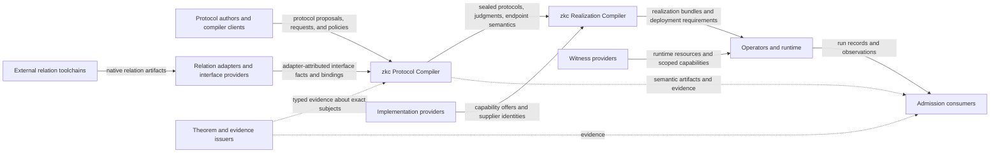
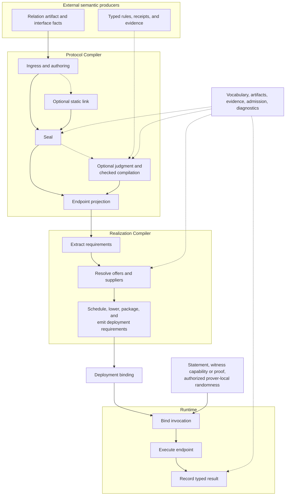
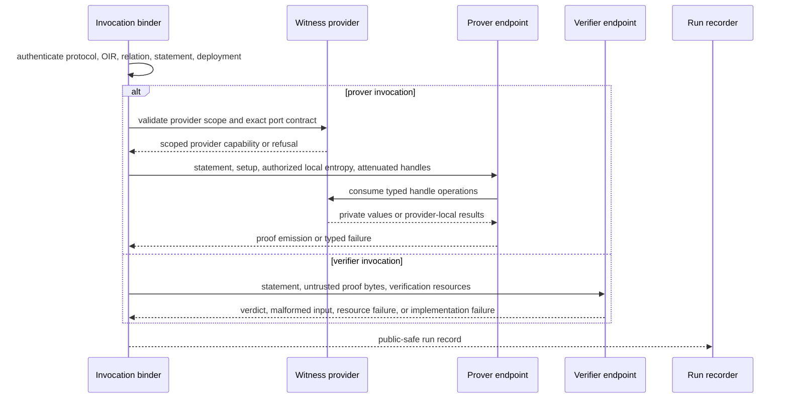
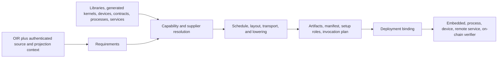
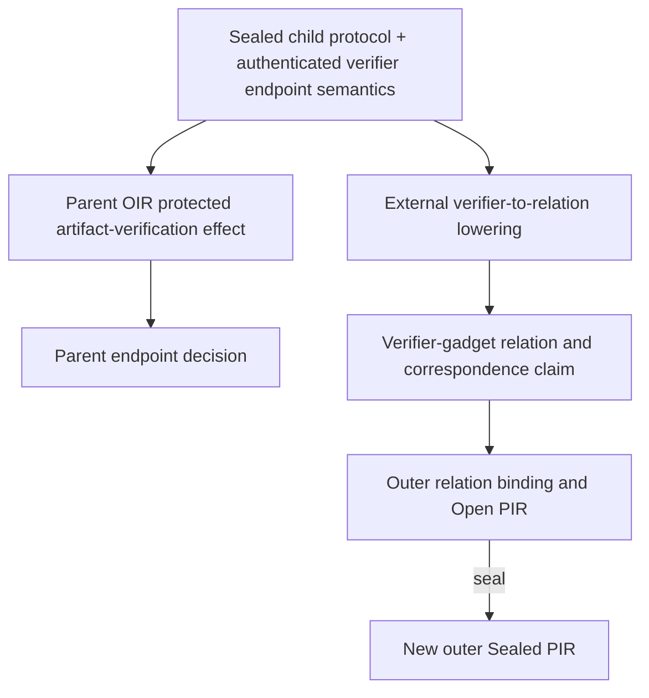

# zkc Target Architecture

> **Document role.** This non-normative reference describes zkc's target
> architecture, including roles that may not be implemented in the current
> checkout. It does not report current support or freeze a public API or wire
> schema. See [Project Overview](overview.md) for the project model,
> [Current Status](status.md) for authoritative implementation claims, the
> [Roadmap](roadmap.md) for planned sequencing, and the
> [specification](spec/overview.md) for exact semantics. The
> [repository README](../README.md) is a compact status summary.

This document is organized as a structural reference. Each section answers a
lookup question about responsibility, artifacts, interfaces, binding, or
trust. Concrete relationships with external projects are catalogued in
[Ecosystem](ecosystem.md).

## 1. System context and ownership boundary

zkc occupies the semantic layer between externally produced relations and the
implementations that prove or verify them. Its primary subject is the proof
protocol as a whole: ordered transcript behavior, typed claim flow, public
bindings, construction obligations, checks, and endpoint decisions. Relation
source languages and predicate construction remain external semantic
authorities. Backend libraries, generated kernels, devices, and services are
implementation providers rather than authorities for protocol meaning.



To **own** a boundary means that zkc defines the contract, authenticates the
relevant identities, checks admissibility, and refuses unsupported or
ambiguous inputs. It does not mean that zkc must implement every producer or
provider behind that boundary.

| Neighbor | Supplies | zkc owns | zkc does not infer |
|---|---|---|---|
| Relation toolchain | Relation artifact and metadata | Reference, interface, instance/statement binding | Predicate meaning, source correspondence, satisfaction |
| Protocol client | Open material, requests, policies | Closure, protocol identity, decisions, projection | Undeclared author intent |
| Formal authority | Rules, receipts, assumptions | Subject binding, typed use, conditions, residuals | Truth from citation or digest; the consumer owns reliance policy |
| Witness provider | Generators, traces, streams, sessions | Ports, capability scope, invocation routing | Confidentiality or satisfaction from delivery |
| Implementation provider | Kernels, libraries, devices, services | Resolution, supplier identity, correspondence obligations | Conformance from self-description |
| Operator | Resources, inputs, authorized prover-local randomness, run policy | Bound invocation, typed result, run record | Universal correctness from one run |
| Admission consumer | Trust policy | Objects, judgments, evidence, refusals | Consumer risk tolerance |

The core protocol model covers explicit public-coin protocols, including
declared Fiat-Shamir closure. A different randomness or interaction model
requires a kernel extension. Soundness, knowledge, completeness, zero
knowledge, Fiat-Shamir admissibility, preservation, and implementation
correspondence remain separate judgments.

## 2. Architecture at a glance

The primary flow has four lanes. External producers establish inputs at
declared trust boundaries. The Protocol Compiler fixes accepted protocol
behavior. The Realization Compiler chooses implementations for already-fixed
endpoint semantics. Deployment binding bridges realization and runtime;
runtime then binds invocation-local values and resources.



The central firewall is semantic: a choice that can change the statement,
transcript, proof ABI, claim graph, checks, terminal decision, assumptions,
child policy, or acceptance-affecting material belongs in the Protocol
Compiler. Target selection, scheduling, layout, transport, caching, and
supplier choice belong in realization only when they preserve that fixed
endpoint contract. Invocation can select only options that were already
authorized by protocol and realization artifacts.

Vocabulary and artifact resolution, typed judgment services, evidence
issuers, consumer admission, diagnostics, and observability are cross-cutting
services. These services cannot bypass lane-specific authentication or boundary
checks; each consumer authenticates its own input and checks the contract it
relies on.

## 3. Logical components and responsibilities

The architecture separates components by semantic authority, even when a
single command or process hosts several of them.

| Component | Responsibility | Explicit non-claim |
|---|---|---|
| Relation ingress and authoring | Produce Open PIR proposals with explicit producer attribution and relation bindings | Relation truth or trusted structure |
| Protocol Kernel | Seal Open PIR under an explicit closure policy, with visible residuals and canonical identity; link Open PIR into a new unsealed proposal | Cryptographic security, semantic equivalence, or endpoint executability |
| Post-seal judgment services | Produce typed derivations with explicit conditions and residuals | Truth or faithful encoding of external rules and premises |
| Checked Compiler Core | Reconstruct the finite comparison scope, lineage, legality, requested judgments, objectives, and deterministic selection | Correctness of admitted domain-provider and transform-family semantics; unrequested properties |
| Endpoint projector | Derive prover or verifier OIR with structural endpoint coverage | Target or semantic correspondence |
| Realization Compiler | Resolve OIR requirements against provider offers and produce target plans with explicit preservation obligations | Supplier conformance |
| Runtime services | Bind authorized resources and execute a typed endpoint | Security or universal conformance |
| Shared infrastructure | Provide fail-closed identity, evidence, registry, and admission services | Unadmitted protocol semantics |

The Protocol Kernel and post-seal judgment services have separate roles. Seal
closes protocol structure. Post-seal services analyze properties such as
soundness, completeness, and zero knowledge. The checked Compiler Core may use
those typed judgments to compare candidates, while artifact identity remains
separate.

## 4. Artifact and identity model

Each semantic boundary produces or consumes a separately identified role.
Packaging several roles together does not merge their identities.

| Artifact or role | Lifecycle | What it identifies | Secret material? |
|---|---|---|---|
| Native relation artifact | Immutable external reference | Exact artifact or reference claimed to carry a predicate | No invocation secret expected |
| Relation interface | Immutable declaration | Public ABI, witness ports, materials, and capabilities | No concrete witness |
| Relation instance | Immutable specialization | Interface plus static parameters | No concrete witness |
| Statement instance | Invocation-scoped or separately identified | Relation instance plus ordered public values | No private witness |
| Protocol binding | Immutable proposal | Relation roles in protocol events, claims, and materials | No reusable secret |
| Open PIR | Editable and untrusted | Proposed protocol content | No invocation secret |
| Sealed PIR | Immutable | Canonical protocol subject | No invocation secret |
| Typed derivation result | Immutable | Proposition, subject, context, and conditions | No raw witness material |
| OIR | Immutable | Encoded endpoint program and embedded source positions; exact coverage is specification-defined | Handle classes, not secret values |
| Realization bundle | Immutable package | OIR, target, suppliers, configuration, and coverage | Protected target artifacts possible |
| Setup artifact | Ceremony-governed | Keys, SRS, indexes, fixed data, and target copies | Secret proving material possible |
| Deployment binding | Controlled state | Authorized roles resolved to physical resources | Secret locations possible |
| Witness-generation contract | Immutable declaration | Private inputs, ports, partiality, randomness, provenance, and failure | No concrete witness |
| Witness resource or session | Lifetime-governed | Private material bound to a relation and statement | Yes |
| Provider capability | Scoped and revocable | Ports, rights, lifetime, delegation, and replay policy | May authorize secret access |
| Invocation capability handle | Linear and invocation-local | Access to one private resource class | Opaque secret-bearing authority |
| Invocation binding | Invocation-local | Semantic, deployment, statement, provider, and run join | Scoped secret capabilities possible |
| Run record | Policy-defined | Observation of one execution | Public form excludes raw secrets |

The specification defines the content identities of Sealed PIR and current
OIR. The target architecture keeps relation, setup, implementation, deployment,
statement, witness, invocation, and run roles separately identified; their
schemas and identity functions remain unspecified until ratified. Evidence
about an unchanged subject does not remint it, and evidence attaches to an
exact node or transition without supplying omitted semantics. Exact encodings
belong to the specification.

A typed linear handle does not by itself establish attenuation, rights,
lifetime, delegation, replay policy, confidentiality, or statement binding;
those require explicit capability contracts.

## 5. Boundary interface catalog

This is a conceptual catalog, not a frozen command, RPC, or wire surface.
Section 12 identifies which boundaries already have normative contracts; the
remaining entries describe target roles.

| Boundary | Input | Output | Establishes | Failure behavior |
|---|---|---|---|---|
| Relation adaptation | Artifact, adapter, format policy | Reference and adapter-attributed interface facts | Parsing and interface claims by one identified adapter about one identified artifact; no semantic correspondence | Refuse unknown, ambiguous, malformed, or stale content |
| Protocol authoring | Interfaces, components, parameters, policies | Open PIR proposal | Explicit structure and dependencies | Diagnose without producing a sealed subject |
| Seal | Open PIR and semantic environments | Sealed PIR | Whole-protocol structural closure and canonical identity | Fail closed; no partial Sealed PIR |
| Static link | Open components and typed component interfaces | New Open PIR | Namespaced proposal and link checks | Refuse mismatched, ambiguous, or unpaired interfaces |
| Derive | Subject, context, rules, explicit plan | Typed conditional judgment | Rule application to the exact subject | Refuse unresolved or invalid steps |
| Checked compile | Source, request, context, providers | Selection, no selection, or refusal | Domain, validity, constraints, deterministic choice | Distinguish no admissible candidate from invalid input |
| Project | Sealed PIR and endpoint kind | OIR | Structural coverage for one admitted endpoint and embedded source positions | Refuse an endpoint whose required behavior cannot be represented |
| OIR realization | OIR, context, target policy, offers | Bundle, plan, obligations, or refusal | Total resolution and a lowering plan constrained to preserve OIR semantics, with explicit residual correspondence obligations | Refuse missing, ambiguous, incompatible, or hidden-effect offers |
| Deployment | Bundle, resources, topology, policy | Deployment binding | Physical resolution of authorized roles | Refuse substitution or trust-zone mismatch |
| Invocation | Endpoint, deployment, statement, witness or proof, and authorized prover-local randomness | Bound run and typed result | Exact runtime join; transcript challenges remain endpoint-derived | Separate refusal, malformed input, failure, and reject |
| Admission | Object, judgment, evidence, policy | Scoped admission or refusal | Policy acceptance for a named use | Unmet policy cannot degrade to acceptance |

Each semantic consumer reauthenticates its subject. Caller identity, cached
acceptance, or an attached receipt cannot replace its required checks.

## 6. Compile-time control and data flows

### Protocol construction and checked change

The normal semantic flow is:

```text
relation/interface ingress + authored components
  -> Open PIR proposal
  -> seal or refusal
  -> Sealed PIR
  -> optional typed judgments
  -> optional checked transform and selection
  -> selected successor authenticated by the core
  -> endpoint projection
  -> one prover or verifier OIR
```

Frontends, generators, importers, linkers, and transform producers emit
untrusted Open PIR proposals that pass through the same seal boundary.

Checked compilation is a finite, explicit decision problem. The request fixes
the comparison scope, required judgments, objectives, and tie-breaking. The
core either enumerates a closed domain or checks every plan in a submitted
finite frontier. The core accepts a submitted result only after independently
reconstructing and evaluating that declared scope.

### Protocol-only transformation and relation-aware change

A protocol-only transformation changes protocol structure under a checked
transform-family relation while keeping the relation and statement binding
fixed. Any rebinding is a separately specified target binding or refinement
transition. Relation-aware change has a longer path:

```text
source relation
  -> externally defined refinement
  -> target relation
  -> public-instance map
  -> optional separately identified witness map
  -> new relation/interface and protocol binding
  -> new Open PIR
  -> seal
```

The refinement arrow records ancestry and obligations; it does not assert
predicate equivalence. Instance correspondence, witness transport, soundness,
completeness, and knowledge transport are separate claims. Any compilation
request that changes both relation and protocol must identify both changes.

### Realization and deployment flow

After projection, the Realization Compiler derives exhaustive requirements
from OIR and its source bindings, resolves them against specified offers,
chooses a legal schedule and lowering, packages target products, and emits
remaining coverage or correspondence obligations. Deployment then resolves
authorized roles to concrete keys, modules, devices, processes, or services.
Both stages preserve transcript events, proof encoding, relation choice,
checks, and the endpoint decision.

## 7. Relation, statement, witness, and invocation bindings

The relation boundary is a **digest membrane**: zkc identifies an opaque
artifact and interface facts attributed to an adapter without deriving
predicate semantics from the digest. Runtime binds a public statement and
authorized private ports to a relation instance; reusable PIR and OIR name
ports, not witness values.



The endpoint result types remain distinct. A prover emits a proof or
failure, never a verifier verdict; verifier rejection remains separate from
malformed input, unavailable resources, and implementation failure.

Invocation handles enforce their declared capability scope and use discipline;
they do not prove confidentiality, correctness, relation satisfaction, or zero
knowledge. Multi-component systems declare witness partitioning, sharing,
ownership, and join obligations explicitly.

Proof bytes are invocation-local I/O. Generator success, checker acceptance,
relation satisfaction, proof emission, verifier acceptance, and security
judgments remain distinct.

## 8. Binding-time, realization, and deployment model

Here **target realization** means implementing fixed OIR semantics. It is
distinct from the Protocol Compiler's transformation judgments. Requirements,
offers, bundles, deployment bindings, and invocation plans below are target
roles rather than claims of stable public schemas.

Semantic authorization, physical materialization, and runtime resolution are
independent dimensions. Creation time alone does not determine when an object
may affect accepted behavior.

| Fact | Semantic authorization | Physical materialization | Runtime resolution |
|---|---|---|---|
| Transcript, claims, checks, decision | Before seal | PIR and OIR | None |
| Relation/interface family | Seal, or a sealed family policy | External artifact and interface | Allowed member before dependent use |
| Endpoint behavior | Projection | OIR | Authorized parameters only |
| Backend, supplier, schedule, layout | Realization policy | Bundle, code, plan, or service configuration | Exact selected deployment |
| Setup, keys, SRS, indexes | Seal or an authorized late-binding policy | Setup or ceremony | Exact authorized resource |
| Public statement | Protocol ABI and late-binding policy | Caller or statement artifact | Before dependent transcript use |
| Witness or session | Port and provider policy | Client, generator, stream, or service | Prover invocation |
| Proof bytes | Verifier proof ABI | Prover output or untrusted input | Verifier invocation |
| Evidence | Independent claim and admission policy | Issuer output | Admission or audit |

Realization joins exhaustive OIR-derived requirements, fully specified supplier
offers, and a total resolution. Offers identify contracts, domains, types,
codecs, modes, limits, state behavior, target properties, and supplier
precisely; a family or primitive name alone is insufficient.

An invocation binds selected resources already authorized by protocol,
realization, and deployment artifacts. Runtime values select among those
authorized resources while endpoint behavior remains fixed. Fiat-Shamir
challenges are derived by endpoint transcript execution.



Scheduling and lowering may vary only while protected OIR effects remain
intact; a whole-endpoint call must cover those same effects. Prover/verifier
interoperability remains a separate
judgment over common ancestry, statement ABI, proof codec, transcript and
challenge behavior, relation and key policy, and deployed variants; separate
endpoint conformance claims are insufficient.

## 9. Composition, recursion, and zkVM system patterns

Composition is classified by where the child semantics live and whether the
parent creates a new protocol subject. Except for the subsets explicitly
admitted by the specification, these are target system patterns rather than a
claim of current generalized composition support.

| Pattern | Composition boundary | New semantic artifact? | Relation work | Required checks |
|---|---|---|---|---|
| Open static linking | Typed interfaces between Open PIR components | Yes: linked Open PIR must seal | None unless relation binding changes | Namespace, challenge, material, claim flow, route, and closure checks |
| Native child verification | Parent endpoint invokes verifier semantics bound to a sealed child protocol | Yes: the parent-child contract is protocol content | No verifier gadget required | Child protocol and endpoint identity, statement/key policy, proof slots, failure, claim route, decision reachability |
| In-relation recursion | Child verifier is lowered into an outer relation | Yes: new outer relation binding and protocol | External verifier-to-relation construction and correspondence | Relation and instance mapping, gadget correspondence, witness transport, outer protocol closure |
| Static aggregation | Fixed child set or tree | Yes: parent protocol | Aggregation relation if verification is in-relation | Cardinality, order, statements, keys, assumptions, exports, whole-system judgment |
| Authorized dynamic family | Runtime member selected from a sealed family policy | Yes: dynamic policy and binding are semantic | Depends on verification path | Allowed-set membership, member commitment, multiplicity, order, pre-challenge binding |
| zkVM sharding | Shard protocols plus continuity, bus, aggregation, compression, or wrapper protocols | One subject per actual proof boundary | VM, chip, transition, continuity, and aggregation relations remain external | Local correctness, boundary state, cross-shard continuity, bus balance, child policy, composition pricing |

Native child verification and verifier-to-relation recursion are distinct:



A runtime-varying child set must be represented either as sealed concrete
structure or by an explicit dynamic policy. Statement binding fixes members,
order, cardinality, keys, and openings before dependent challenges; a run
record cannot create that binding.

For zkVM-shaped systems, application, ISA, chip, and transition meaning remain
external. zkc represents protocol-facing identities, interfaces, child
contracts, transcript effects, continuity routes, wrappers, and composition
judgments. Each proof boundary defines a separate seal unit, regardless of
product packaging.

## 10. Trust, evidence, admission, and conformance

The architecture preserves five distinct layers:

```text
identified and independently reauthenticated object -> typed judgment
  -> attributed evidence -> consumer admission -> concrete execution
```

The matrix states architectural contracts. Section 12 identifies which are
normative and which are target-only; implementation coverage belongs in the
status report.

| Boundary | Authenticates or checks | Output guarantee | Residual trust |
|---|---|---|---|
| Relation adapter | Native bytes, format, adapter identity, declared extraction | Adapter-attributed parsing and interface claims about one artifact | Adapter correctness, source intent, predicate semantics |
| Seal | Open PIR, admitted semantic references, whole-object structural judgments | Canonically identified sealed subject with explicit residuals | Opaque external anchors, cryptographic properties, implementation behavior |
| Judgment evaluator | Already-authenticated sealed view, subject and site, context, rules, plan, premises | Checked derivation under declared rules and hypotheses | Truth and faithful encoding of external rules and premises |
| Checked Compiler Core | Request, exact comparison scope, provider logic, candidate lineage, constraints, objectives | Deterministically checked semantic decision | Correctness of admitted domain-provider and transform-family semantics; properties not requested |
| Projector | Sealed source, endpoint obligations, protected effects | Structural coverage and embedded source positions for one endpoint | Semantic correspondence, target implementation, and facets outside carrier identity |
| Realization Compiler | OIR, offers, resolution, lowering, coverage | Target implementation plan and explicit obligations | Supplier correctness and undischarged correspondence claims |
| Witness provider | Relation/statement scope, port contract, capability policy | Scoped delivery or explicit refusal | Secret correctness, confidentiality enforcement, relation satisfaction |
| Executor | Invocation join, deployment, endpoint ABI, runtime resources | One typed result and an observation attributed to the executor | Host/device/service correctness and unobserved executions |
| Admission policy | Evidence types, issuers, subjects, conditions, intended use | Scoped permission to rely on supplied material | Consumer-chosen trust anchors and accepted residual risk |

Judgments retain their property, subject, conditions, and open obligations.
Evidence supports its declared claim, and admission applies to the named use.
Theorem validity remains independent of subject identity.

Endpoint correspondence separately checks OIR effects, relation and key
binding, supplier and toolchain provenance, unsupported modes, and residual
assumptions; equal outputs are insufficient. Consumers reject unknown semantic
content. Refusal, malformed input, implementation failure, verifier rejection,
conditional judgment, and admission refusal remain distinct.

## 11. Extension model and architectural invariants

zkc defines three independent extension boundaries, each with its own
authority.

| Extension boundary | Required input | Admission boundary | Identity impact | Prohibited effect |
|---|---|---|---|---|
| Semantic contract | Versioned protocol vocabulary or relation/interface contract | Named semantic consumer validates admitted content and dependencies | May create bindings or enable new protocol identities | Encoding implementation or evidence claims as protocol meaning; treating adapter output as predicate truth |
| Implementation/capability | Offer, supplier identity, target properties, ABI, and failure contract | Realization resolution and correspondence policy | Creates implementation, bundle, deployment, or invocation identities | Changing fixed protocol or endpoint semantics |
| Evidence-issuer extension | Claim type, subject-binding rule, issuer identity, assumptions, verification procedure | Consumer evidence and admission policy | Creates evidence identity only | Redefining the subject or implying unrelated judgments |

These categories define integration points for neighboring tools while
preserving authority boundaries. They do not imply implemented plug-in
interfaces.

The following invariants govern every extension:

| Invariant | Architectural consequence |
|---|---|
| Protocol meaning is fixed before target realization | Any target choice that changes accepted behavior returns to protocol compilation |
| Every semantic change creates a new authenticated semantic artifact | Evidence, deployment, or a run cannot retroactively mutate protocol meaning |
| Evidence describes an object and never redefines it | Claim, issuer, subject, conditions, and use remain separately identified |
| Concrete witness material is not reusable protocol identity | PIR and OIR carry witness contracts and handle classes; invocation supplies scoped access to private material |
| Protected endpoint effects remain explicit | Opaque providers and fast paths cannot hide transcript, proof-stream, check, child, or decision effects |
| Every judgment is typed and bound to an exact subject | No theorem, receipt, or observation transfers by naming similarity |
| Composition is a new judgment boundary | Component closure or security does not automatically establish whole-system security |
| Physical deployment cannot authorize semantics | Keys, services, devices, and packages resolve only previously authorized roles |
| Unknown semantic content fails closed | Extensibility requires admitted contracts, not permissive fallback |

These invariants apply across changes to APIs, encodings, providers, and
targets.

## 12. Authority map

This table identifies the normative or operational authority for each
architectural topic. “Architecture-only” means that this document defines the
intended role and boundary but does not claim a ratified wire surface.

| Topic | Owning authority | Architectural status |
|---|---|---|
| Protocol object, seal, content identity, and current kernel binding-time rules | [Protocol Kernel](spec/kernel.md) | Normative semantic core |
| Typed security and completeness judgments | [Soundness Kernel](spec/soundness.md) | Normative judgment core |
| Checked transformation, finite search, objectives, selection | [Compiler Core](spec/compiler.md) | Normative protocol-compiler core |
| Seal, project, link, conformance boundaries | [Boundaries](spec/boundaries.md) | Normative boundary contracts |
| Current verifier and prover-skeleton endpoint semantics | [Endpoints](spec/endpoints.md) | Normative endpoint model |
| PIR/OIR representation and canonical carrier identity | [Carrier](spec/carrier.md) | Normative representation |
| `ProtocolVocabulary` and current vocabulary admission | [Vocabularies](spec/vocabularies.md) | Normative registry model |
| Format evolution and diagnostic allocation | [Versioning](spec/versioning.md) | Normative lifecycle rules |
| General relation, setup, witness, deployment, and invocation bindings, including adapters, providers, and sessions | This architecture, pending dedicated specification surfaces | Architecture-only target roles |
| Target Realization Compiler, deployment, and generalized correspondence | This architecture plus reserved boundary concepts | Architecture-only role |
| General child, recursion, dynamic-family, and zkVM composition | This architecture, with any admitted subset governed by the specification | Architecture-only system patterns |
| Implemented capability and reproduced evidence | [Current Status](status.md) | Operational reporting |
| Dependency order and future work | [Roadmap](roadmap.md) | Planning authority |
| Named external-project relationships | [Ecosystem](ecosystem.md) | Integration context |

When this architecture and a normative specification disagree, the
specification governs. Current support belongs in status reporting; planned
order belongs in the roadmap.
