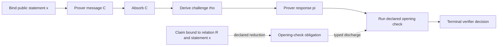
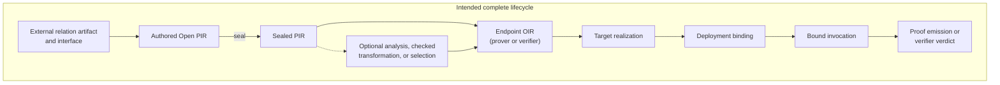

# zkc: A Compiler for Zero-Knowledge Protocols

> **Document role.** This document explains zkc's stable project model and
> target direction; it does not report current implementation support. See
> [Current Status](status.md) for authoritative implementation and evidence
> claims, and the [repository README](../README.md) for a summary. See
> [Target Architecture](architecture.md) for structural detail, the
> [Roadmap](roadmap.md) for planned sequencing, and the
> [Specification Overview](spec/overview.md) for normative semantics.

Zero-knowledge systems include a protocol layer between an already formed
relation and endpoint execution. Its transcript, claims, challenges, checks,
reductions, and terminal decision determine what proof is made and accepted.
zkc makes that protocol an explicit compilation subject.

A running example traces these boundaries through protocol compilation,
private witness use, target realization, compiler judgment, invocation, and
composition.

## 1. The missing compiler layer

The ZK ecosystem already has sophisticated tools on both sides of a proof
protocol. Relation languages and compilers turn programs, circuits, constraint
systems, AIR descriptions, or virtual-machine semantics into predicates over
public and private data. Proving libraries implement polynomial commitments,
interactive oracle proofs, transcript constructions, recursion machinery, and
highly optimized cryptographic kernels. Both layers are essential, but neither
alone determines a complete proof.

The protocol also fixes the relation instance and public-input encoding;
prover messages and transcript order; challenge derivation; reductions and
checks; and the verifier's terminal acceptance condition. In many systems,
these decisions are distributed across protocol descriptions, host
orchestration, backend APIs, transcript wrappers, verifier logic, and
implementation conventions.

These choices are semantically significant. Changing an absorb order,
challenge prefix, public-input encoding, check, or verifier key can alter the
statement or proof language the verifier accepts. zkc therefore represents the
proof protocol as a canonically identified object and checks compiler decisions
against it.

This places zkc downstream of relation compilation and upstream of concrete
endpoint execution. Relation compilers remain authorities for relation
artifacts; proving libraries remain implementation providers; proof assistants
and cryptographic analyses remain external evidence sources. zkc binds their
contributions to one protocol subject without conflating their authority.

zkc does not replace relation-source languages, provers, or theorem provers. It
makes the protocol decisions connecting those systems explicit, authenticated,
and amenable to compiler judgment.

## 2. The protocol as the compiled object

Consider an externally defined relation

`R(x, w) = 1`,

where `x` is a public statement and `w` is private witness material. A small
schematic protocol might bind `x`, send a commitment `C` derived from private
prover state, derive a transcript challenge `rho`, send an opening or response
`pi`, run a declared verification check, and accept only if the required claim
has been discharged. The example deliberately leaves the commitment scheme,
field, transcript construction, and relation representation unspecified. Those
details are bound through declared contracts outside the notation.

The architecture distinguishes four objects:

| Object | What it determines |
|---|---|
| **Relation** | Which public and private values satisfy the predicate. |
| **Protocol** | Which interaction, claims, transcript events, checks, and decision establish the intended proof. |
| **Realization** | Which concrete code, library, kernel, device, or service implements a fixed endpoint. |
| **Invocation** | Which statement, witness capability or proof, setup resources, deployment, and authorized runtime-local inputs participate in one run. |

zkc models a protocol through two complementary views. The first is an ordered
**transcript spine**. It fixes public bindings, messages, absorbs, challenges,
checks, and every decision-relevant ordering constraint. The second is a typed
**claim-flow graph**. It records where proof obligations originate, how
declared reductions transform them, and where they are discharged, exported,
or left as explicit residual obligations.

The dashed arrow denotes a named reduction contract whose security
justification is judged separately.

The spine preserves the order of protocol operations. The claim graph connects
each accepting check to a declared proposition. Contracts join the two views by
identifying the check, its permitted claim transformation, the material and
parameters it uses, and the terminal rule through which its result affects
acceptance.

Protocol IR, or **PIR**, is the representation of this subject. Authoring and
import produce **Open PIR**: editable, untrusted protocol material. Open PIR
need not be written directly: protocol DSLs, family-specific frontends, and
importers may elaborate into it. Their outputs remain untrusted and cross the
same seal boundary.

A seal boundary verifies admitted protocol dependencies, preserves external
anchors as opaque references, checks the protocol's structure as a whole, and
keeps every assumption, export, or residual route visible. If that succeeds,
the result is **Sealed PIR**, an immutable, canonically identified protocol
subject that each semantic consumer must reauthenticate before use.

Sealing has a defined scope. It establishes structural closure and content
identity under the selected policy. A closed proof artifact is a stronger
classification governed by the specification. Relation satisfaction,
soundness, completeness, knowledge extraction, zero knowledge, and backend
correctness remain separate propositions.

A sealed identity identifies the protocol to which later evidence,
transformations, endpoints, and executions refer. Later claims remain limited
to what their evidence establishes.

## 3. Protocol compilation and target realization

The target lifecycle separates protocol compilation, target realization,
deployment, and invocation. The **Protocol Compiler** fixes accepted behavior,
and the **Realization Compiler** implements that behavior for a target.
Deployment resolves target resources; invocation binds per-run inputs to one
deployed realization.

The Protocol Compiler consumes relation-facing interfaces, protocol
components, contracts, parameters, and composition choices. It constructs and
seals protocol subjects, may evaluate typed judgments or perform checked
transformations, and derives endpoint semantics. Any change to the statement,
transcript, claims, proof encoding, checks, terminal decision, relation binding,
or acceptance-affecting parameters belongs in this layer and creates a new
identified semantic subject.

Projection derives one prover or verifier **Operator IR (OIR)** artifact from
Sealed PIR. The Realization Compiler maps that fixed endpoint contract to a
target implementation. This behavioral boundary is the semantic firewall:
layout, scheduling, transport, and supplier choices may vary within the
contract, while changes to accepted behavior return to protocol compilation.
Section 6 describes endpoint and realization semantics in detail.

Invocation binds the public statement, a prover witness capability or verifier
proof, setup material, suppliers, deployed endpoint, and any authorized
prover-local randomness. These values affect one run and cannot select a new
reusable realization, change accepted behavior, or supply Fiat-Shamir
challenges.

## 4. Where relation, statement, and witness enter

Relation-source compilation remains external to zkc. In the intended
architecture, the relation `R` in the example may originate in a circuit
compiler, an AIR toolchain, a VM or chip definition, a constraint interchange
format, or a custom relation builder. That producer owns its native artifact
and whatever correspondence it claims between source intent and the resulting
predicate.

The protocol boundary consumes a relation identity and interface facts
attributed to an identified adapter: the ordered public ABI, types and shapes,
material roles, witness ports, and any property on which a compiler rule
relies. Together with a relation instance, these facts bind `x` at the protocol
boundary and identify which private resources may supply `w`.

This boundary is a **digest membrane**. A content digest identifies the native
artifact inspected by the adapter, while the adapter attributes interface facts
to that artifact. Mathematical meaning and source correspondence remain with
the external relation authority.

The public statement and private witness also have different lifecycles. `x`
is a value of a particular relation instance and is bound through the endpoint
ABI and transcript at the authorized time. PIR and OIR carry witness ports and
contracts rather than `w` itself. The witness may be advice columns, an
execution trace, a stream, a lazy oracle, an MPC-held secret, or state held by
a confidential remote service.

For that reason, the target architecture treats witness access as a typed
capability. A generator may produce or expose private material; a resource or
session binds that material to a relation and statement; and a provider
authorizes operations on declared witness ports. At invocation, the runtime
checks these bindings and gives the endpoint only the operations needed for
that run.

In the example, the prover endpoint receives a handle authorized to derive the
committed state for `C` and another operation needed to construct `pi` for the
challenge `rho`. The handle is threaded linearly through the endpoint and
consumed before the invocation ends. This makes routing, ownership, and
accidental duplication checkable without making private values part of
protocol identity.
Confidentiality still depends on the provider, runtime, transport, and target.

This architecture leaves room for zkc to ship witness generators, trace
builders, checkers, or confidential-provider integrations. Whether they are
built in-tree or attached through a contract is secondary to preserving their
semantic role. Generator success records production of private material. A
relation-satisfaction claim requires admitted evidence and a correctness path.
Protocol soundness, proof emission, and verifier acceptance remain separate
results.

## 5. Compiler judgments and authenticated decisions

Once a protocol is sealed, zkc can ask typed questions about it. The model
distinguishes five stages: object, judgment, evidence, admission, and execution.

The object is independently reauthenticated before use. A judgment is a
precisely typed proposition about it in an explicit context. Evidence is
material from an identified source that supports the judgment:
perhaps a checked derivation, a mechanized theorem receipt, a correspondence
result, or a bounded observation. Admission is a consumer's decision to rely
on that evidence for one use. Execution is what a particular implementation
actually did. Each layer can refer to the preceding one, but none may redefine
it.

Security decomposes into distinct judgments: structural closure, computational
soundness, knowledge or extraction soundness, completeness, zero knowledge,
Fiat-Shamir admissibility, transformation preservation, endpoint
correspondence, and target correspondence. They can have different assumptions,
parameter regimes, evidence, and failure states. A conditional result or open
obligation remains useful while reported as unresolved.

Return to the running example. Sealing can establish that the opening-check
obligation is connected to the terminal decision through admitted contracts.
A separate security derivation might state that, under named properties of the
commitment and challenge construction, a successful cheating prover for the
sealed protocol yields a solver for another declared claim with an explicit
loss. Evidence from a formal system might support one premise. A backend replay
might show that one implementation produced the expected transcript on a
bounded vector. These facts concern related subjects but establish distinct
propositions: a theorem premise, a bounded backend observation, a security
derivation, target correspondence, and verifier acceptance.

The same discipline governs compiler search. A decision is checked against a
declared finite choice space: zkc reconstructs the candidates from the sealed
subject and recomputes the requested judgments, objectives, and deterministic
choice. Candidate generation, structural legality, and a lower reported cost
are separate facts; none authorizes a semantic change or establishes an
unrequested security property.

Rule encoding and rule validity are separate. External formal or analytic
authorities supply rules and evidence; zkc checks typed application and subject
binding; the consumer decides whether to rely on the result. This lets the
compiler use external work while keeping its source and remaining assumptions
explicit.

## 6. From endpoint semantics to implementations

OIR records the fixed protocol effects that an implementation must preserve:
public and proof I/O, transcript order, challenge derivation, data dependencies,
checks, child-proof verification, construction routes, and the endpoint
outcome. Target-specific scheduling and code generation remain open below that
contract.

Each projected endpoint artifact derives from the same Sealed PIR. In the
example, the verifier view consumes untrusted proof bytes and returns a verdict,
a malformed-input result, or an implementation failure. The prover view
consumes the statement and invocation-local private handles and either emits
proof bytes or fails. Shared source provenance makes pair correspondence
checkable.

The Realization Compiler extracts the semantic and operational capabilities
required by OIR. A target offer identifies its supplier and matches those
requirements. A conforming realization can then schedule, lower, package, and
emit deployment requirements for the endpoint. Deployment then binds concrete
resources. Missing or incompatible capabilities cause realization to fail.

A target can be generated code, an embedded cryptographic library, a generated
CPU or accelerator kernel, a local process, a device program, an on-chain
module, or a remote proving or verification service. Coarse-grained calls are
also possible. An entire endpoint may be delegated to a backend only when the
call is checked as an implementation of the declared OIR pattern and its
correspondence obligations cover every protected effect. Agreement on the final
accept/reject result is insufficient to detect a changed transcript, skipped
end-of-proof check, incompatible encoding, or substituted relation.

Endpoint, realization, setup, deployment, and invocation bind different facts
and therefore retain separate identities. The specification and status report
define what each current identity authenticates.

Independently realized prover and verifier endpoints require a separate pair
correspondence judgment covering sealed ancestry, paired OIR, keys, and
deployment. A disagreement in statement, proof, or transcript semantics is a
conformance failure. Proof emission and verifier acceptance are also distinct
run results; the protocol's cryptographic properties require their own
judgments.

## 7. From one protocol to proof systems

Real proof systems combine components, verify child proofs, aggregate
instances, compress or wrap proof languages, recurse, and distribute execution
across shards. The target architecture represents every acceptance-affecting
composition choice as protocol structure.

There are two distinct forms of composition. **Open static
linking** combines protocol components before sealing. Their typed interfaces,
claims, transcript domains, materials, and shared challenges must be joined,
and the resulting Open PIR is sealed as a new whole. Linking does not inherit a
security theorem merely because each component had one.

**Child-proof composition** begins with an independently sealed child whose
assumption, export, and residual routes remain visible. A parent can verify the
child through a protected endpoint effect governed by a parent contract.
Alternatively, the child verifier can be compiled into a relation or gadget
used by a new outer protocol. That verifier-to-relation step is relation work:
it creates a new predicate and needs a separately checked correspondence. It
may not be introduced invisibly as an implementation optimization. The exact
child-contract roles are catalogued in the
[Target Architecture](architecture.md#9-composition-recursion-and-zkvm-system-patterns).

Aggregation, compression, wrapping, and recursion often change the proof
language or accepted behavior. When they do, they create a new semantic subject
that travels through authoring, sealing, judgment, projection, and realization.
Runtime multiplicity also needs an authorized shape: a fixed expansion or a
sealed policy for selecting members, ordering them, binding their identities,
and rejecting omission or duplication. A run record can report which members
were used, but it cannot retroactively authorize them.

A zkVM decomposes into independent capabilities: external instruction, chip,
and transition relations; trace or witness production; shard protocols;
memory, bus, and continuity obligations; aggregation and wrappers; prover and
verifier implementations; recursive verifier relations; and deployed services.
Instruction semantics may remain external while zkc owns protocol-facing
relation identities and adapter-attributed interface facts, protocol bindings,
transcript and claim structure, child policies, endpoint effects, and typed
system-level judgments.

Backend kernels, witness generators, proving services, and hardware backends
are independent extension points. Their implementations can live alongside the
compiler while relation and protocol meaning remain with their declared
authorities. Any composition pattern that changes accepted proofs belongs above
the semantic firewall, even if first implemented in a backend library.

## 8. Target scope and extension model

The target is compiler support across the proof-protocol lifecycle:
authenticated construction, structural closure, typed security and
correspondence judgments, checked transformation and selection, endpoint
derivation, target realization, deployment, composition, and evidenced
execution. This lifecycle coverage is zkc's north star. The scope extends
beyond one IR or backend without assigning zkc authority over every producer
or executor.

Here, “complete” means lifecycle coverage for the protocol class admitted by
the kernel, not universal support for every interaction or randomness model.
Additional protocol classes require explicit semantic extensions.

The architecture defines three independent extension boundaries. The
**semantic-contract boundary** admits protocol vocabulary,
construction-profile content, relation-interface contracts, and other
protocol-facing contracts. The **implementation boundary** admits libraries,
generated kernels, devices, services, and targets that offer those contracts.
The **evidence-issuer boundary** admits formal receipts, independent checkers,
correspondence results, vectors, attestations, and observations for scoped
judgments. Admission at one boundary grants no authority at another.

Within this target architecture, zkc owns protocol objects, identities,
bindings, checked decisions, endpoint derivation, realization requirements, and
typed evidence-binding surfaces. External authorities retain relation-source
meaning and compiler correctness, theorem validity, consumer admission policy,
implementation conformance beyond admitted evidence, operator trust, and
application or VM semantics.

These authority boundaries apply throughout the architecture. Each artifact,
judgment, and execution result carries only the authority established at its
own boundary.

At every stage, the architecture records the subject, judgment, evidence
source, admission decision, and execution. This traceability makes the protocol
lifecycle auditable as a compilation process.

Continue with [Current Status](status.md) for the implementation and evidence
report, or the [repository README](../README.md) for its summary. See
[Target Architecture](architecture.md) for components and trust boundaries,
[Ecosystem](ecosystem.md) for concrete neighboring projects,
[Roadmap](roadmap.md) for planned sequencing, the
[Specification Overview](spec/overview.md) for exact semantics.
