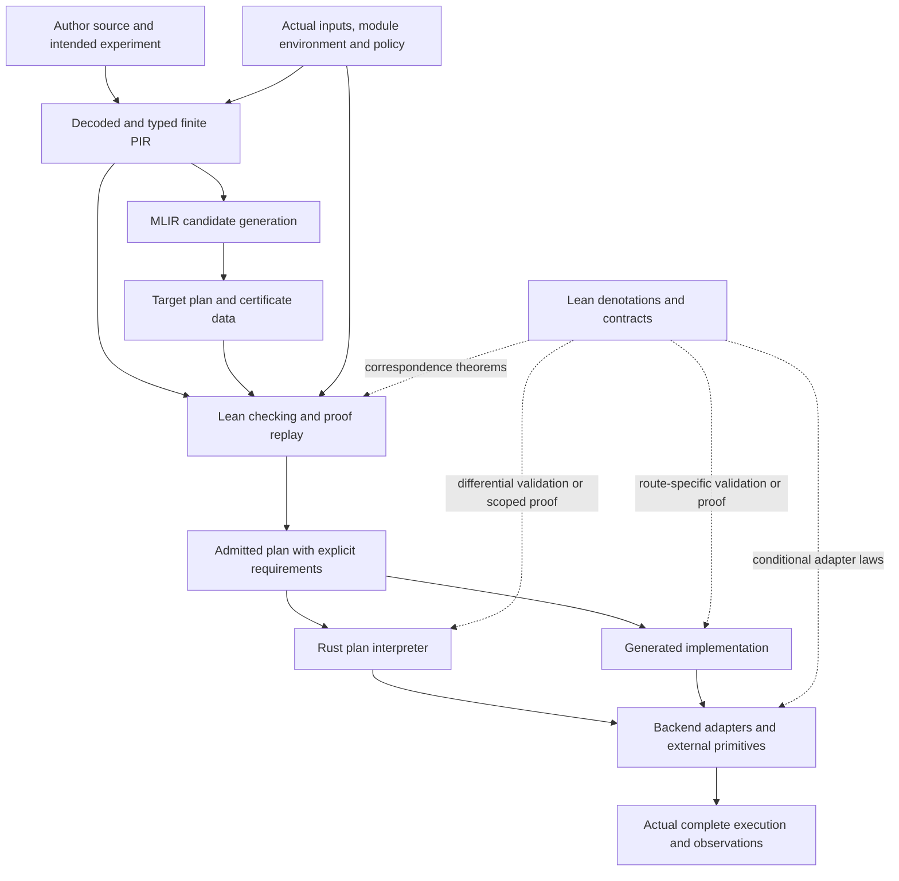

# Connecting the formal library to executable zkc

This
dossier develops the implementation connection of the [library design](../DESIGN.md).
It does not replace the [selected PIR semantics](../../docs/spec/README.md).
Its recommendations are architectural decisions for implementation, not evidence
that the present compiler or an external backend already satisfies them.

The [integrated roadmap](../../docs/roadmap.md) owns current delivery scope and
sequencing; [support](../SUPPORT.md) records the formal capabilities these
chapters connect.

## 1. The connection in outline

Build a maintained Lean library of meanings, contracts, algorithms and theorems.
Connect it to an untrusted optimization producer through checked, finite data.
Connect that data to execution through a small runtime and explicit backend
contracts. Use [differential testing](../../docs/assurance.md#6-implementation-correspondence-policy)
as the default validation between executable Lean meanings and actual MLIR/Rust
paths, and prove selected native boundaries where useful. This combines verified
components, translation validation and empirical execution evidence with distinct
assurance scopes; neither the entire optimizer nor runtime needs a proof first.

| Document | Question answered |
|---|---|
| This map | What must be connected, and what does each guarantee mean? |
| [Compiler connection](compiler-connection.md) | How do actual source, MLIR changes, certificates and executable plans meet Lean? |
| [Native correspondence](native-correspondence.md) | How do Rust, codecs, state and external primitives implement the contracts? |
| [References](sources.md) | Primary references behind these chapters, and the limits of what they establish |

There are two deliverable execution routes. A coarse-grained plan interpreter
is the first recommended correspondence baseline. A generated implementation
can become the performance route with its own lowering/code-generation evidence
or an explicit compiler trust assumption. Both consume the same admitted
algorithm and module contracts. Neither route is a prerequisite for proving all
cryptographic backend internals.

## 2. A map of the complete connection



The bottom of this diagram is not automatically proved by its top. A theorem
about a Lean denotation is a theorem about that denotation. Every actual carrier
and execution boundary needs a relation, a check, or a stated trust assumption.

| Boundary | Required proposition or obligation | Proposed home and first assurance |
|---|---|---|
| Human intent → source | The chosen protocol/experiment is actually the intended one | Protocol specification, examples and review; no automatic theorem about human intent |
| Bytes/builder → raw syntax | Decoding identifies the complete input, framing and supported schema | Source adapter; checked decoder or explicit parser trust until proved |
| Raw → typed syntax | Sort, arity, scope, region/capture and constructor checks establish formation | `Source`; executable admission with a soundness theorem |
| Syntax + environment → meaning | The actual binding and module interpretation satisfy admission, availability and required laws | `Source` and `Modules`; premises from actual installation, remaining provider assumptions explicit |
| MLIR → represented program | Export/import covers the actual operands, regions and operations | Compiler adapter; initial output validation against an independently retained source |
| Analysis → useful facts | Each fact denotes a property of the reached state; transfer/invalidation preserves it | `Compiler.Analysis`; abstract interpretation and semantic frames |
| Source → optimized plan | The fixed relation holds under the fixed source-relative requirements | `Compiler.Checking` and transformations; checked certificates and reusable lemmas |
| Typed plan → erased executable data | Erasure preserves the meaning and the checks that remain dynamic | `Compiler.Lowering`; checked erasure plus interpretation theorem |
| Plan → runtime/code | Actual instruction dispatch or code generation implements that plan | `Realization`; differential validation with explicit implementation trust, optionally strengthened by scoped native proofs |
| Native values/state → logical values/state | Representation relation covers results, mutations, failures, ownership and callbacks | Backend adapter; common contracts, selective native proof |
| Wire/entropy/primitive → module semantics | Hostile decoding, joint randomness and primitive laws match the actual interface | Codec/provider adapters; distinct functional and cryptographic assumptions |
| Built/loaded artifact → checked subject | Executed bytes, features, target, provider configuration and checked evidence agree | Build/loader binding; reproducible records and actual loader checks, with explicit system trust |
| Execution relation → claimed property | The experiment, observer, strategy class and losses satisfy a transport theorem | `Properties`; individual property theorem, not a generic security Boolean |
| Proof production → trusted theorem | Exact theorem statement and its transitive axioms meet the assurance policy | Lean kernel, pinned dependencies, theorem/axiom audit and proof replay |

This map intentionally includes compilation after validation. Validating PIR
and subsequently trusting arbitrary generated native code leaves a compiler
boundary open; it does not invalidate the PIR theorem, but limits the end-to-end
claim. CompCert and CakeML are useful precedents for stating such boundaries
and composing compiler correctness results. [S1–S3](sources.md#s1)

## 3. The theorem shape

For a deterministic first slice, let `S` be admitted typed source, `T` its target
plan, `b` the actual interpreted binding, and `n` a native initial state.
The intended claim has this shape:

```text
admission(S, b)
∧ check(policy, S, T, certificate) = accepted requirements
∧ holds(requirements, b)
∧ nativeStateRel(n, logicalInitial(b))
∧ runtimeAndBackendContracts(actualImplementation, b)
⇒ executionRel(runNative(T, n), denote(S, b))
```

The checker soundness theorem establishes the source/target semantic relation;
runtime refinement connects the actual target execution. Neither theorem should
manufacture a backend law from a backend name or an unchecked declaration.
Initialization and reached-call preconditions have explicit producers. A static
check can leave a dynamic guard in the program; that guard's failure remains in
the semantics.

The relation must cover returned values, terminal outcomes, final states and
ordered observations. Different native and logical result types need a relation,
not literal equality. Error variants may map differently only when the selected
contract justifies the mapping. A Rust panic is not silently a PIR rejection.

For a nondeterministic or probabilistic runtime, replace a single result with
the appropriate behavior or distribution relation. Mere inclusion of successful
behaviors is inadequate: an implementation with no successful executions could
satisfy it vacuously. Require the promised progress/termination and permitted
failure behavior, or state a weaker partial-correctness guarantee explicitly.
For finite PIR, handler termination is still an assumption until connected to
the native implementation; a finite syntax tree does not make a foreign call
terminate.

An execution relation is not itself zero knowledge or soundness. Property
transport additionally fixes initialization, adversarial strategies, observations,
resource limits and the security experiment. Equality of abstract mathematical
functions cannot supply a computationally efficient simulator. Robust preservation
against arbitrary linked target code is a stronger problem than running the same
supplied source under two related handlers. [S4](sources.md#s4)

## 4. What the library supplies

| Current evidence | Useful result | Connection still missing |
|---|---|---|
| [Execution](../Zkc/Semantics/Execution.lean): `replacement_then`, `run_related` | Replacement under continuation and common-process handler refinement | Heterogeneous logical values are handled by `Simulation` below; actual native instances remain work |
| [Simulation](../Zkc/Realization/Simulation.lean): `Execution.Relates`, `follow`, `trans` | State-dependent heterogeneous returned values, exact stops, related final states and projected events; sequencing/composition laws | Logical source/plan and allocation/load clients exist; actual native decoder/storage correspondence and progress remain work |
| [Endpoint](../Zkc/Source/Endpoint.lean) and [local-code admission](../Zkc/Protocols/Sumcheck/LocalProver/Admission.lean) | Admitted source/body association and explicit joined formation/execution premises | Finite typed source, direct-plan codecs and selected effectful frontends exist; arbitrary external frontend/native adequacy remains work |
| [Binding](../Zkc/Modules/FactorBinding.lean): `instantiated_valid`, `instantiated_caller` | Actual modeled installation produces facts consumed by a caller | Native heap allocation, aliasing, loader and actual backend realization |
| [GuardedCompilation](../Zkc/Polynomial/Bilinear/Compilation.lean) | Analysis/preparation simulation up to actual readiness refusal under reached-call conditions | A serialized certificate checker and native compiler pass applying it |
| [Judgment](../Zkc/Properties/Judgment.lean) | Logical conditional evidence and requirement composition | A logical proof-bearing result is not yet a portable executable proof artifact |
| [Library design](../DESIGN.md) | Maintained capability APIs, independent main package and optional ArkLib integration; no numbered/Compat dependency | New native/extracted adapters must preserve the package and declaration boundaries |

`run_related` preserves failure state and observations using the same reply
types and process. The implemented `Execution.Relates.of_related` embeds its
relation into the newer heterogeneous relation. Neither supplies an existing
Rust codec or arbitrary lowering theorem. The property library similarly gives
mathematical transport components, not proof that Arkworks implements them.

## 5. Assurance is a collection of scoped results

Use a structured record of claims and assumptions rather than a single rank.
A kernel-replayed optimizer certificate can coexist with a trusted native field
backend. A natively verified decoder can coexist with an unproved protocol
security hypothesis. These are useful, different configurations.

| Mode | What was actually checked | Remaining trust relevant to that mode |
|---|---|---|
| Exploration | Parser, tests, bounded searches, native checker results as recorded | No universal theorem follows from those checks |
| Kernel proof replay | The instantiated certificate conclusion and its dependencies | Lean kernel/foundations, statement adequacy, inputs and any explicitly assumed implementation boundary |
| Compiled checker acceptance | Execution of the compiled checker whose mathematical function has a soundness theorem | Additionally its compilation/runtime and I/O connection; a native `true` is not a proof term |
| Proof using native evaluation | A theorem depending on the actual native-evaluation mechanism | Additional compiler/evaluation axioms must be recorded and accepted by a separate policy |
| Differential execution validation | Recorded cases on actual MLIR/Rust paths agree with executable Lean meanings under a declared relation | Untested cases, adequacy of the comparator/reference, native compilation and execution; no universal theorem |
| Proved native correspondence | Proof about an extracted or otherwise modeled actual implementation | Extraction/translation, external models and downstream native toolchain unless separately discharged |

The current axiom audits allow only `propext`, `Classical.choice`, and
`Quot.sound`. Inspection of installed Lean **4.33.1** shows that `native_decide`
uses `Lean.Meta.nativeEqTrue`, which adds an axiom for the computed Boolean;
the inspected `bv_decide` path also calls that mechanism. Do not silently use
either to claim the existing restricted-axiom assurance. The exact mechanism is
version-sensitive; audit dependencies rather than tactic spelling alone.
[S5](sources.md#s5)

The root package pins Lean 4.33.1. Actual compiler/native connections follow the
[current roadmap](../../docs/roadmap.md).
